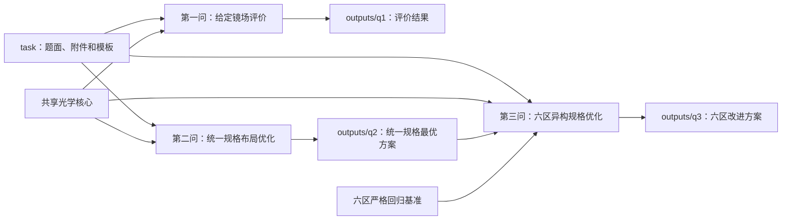

# 项目计算流程与文件职责

本文档说明项目从题目输入到正式结果的完整计算链路，以及各模块、测试、文档和
输出文件之间的关系。`README.md` 负责项目总览与运行方式；本文档进一步回答
“数据从哪里来、经过哪些计算、每个文件负责什么、修改后需要检查什么”。

## 1. 总体计算链路

三问共用同一套太阳位置、镜面姿态、阴影遮挡、大气透射和截断效率模型。第二问
在共用模型上搜索统一规格镜场；第三问沿用第二问的 Campo 参数化布局，再把固定
规格扩展为六区异构规格。



这里的依赖关系不是简单的文件复制：

- 第一问确定全项目统一的光学效率和功率计算口径；
- 第二问调用同一评价器比较两种布局，并输出 Campo 方案参数和最终坐标；
- 第三问读取第二问 Campo 参数，按六区边界重新生成母场和逐镜规格，同时使用
  `six_group_baseline.json` 检查旧方案能否被当前代码严格复现；
- 三问的正式结果分别写入独立输出目录，不覆盖 `task/` 中的原始附件。

## 2. 输入、配置与正式计算口径

### 2.1 原始输入

| 文件 | 用途 | 是否由程序修改 |
| --- | --- | --- |
| `task/A题.pdf` | 题目条件、规定计算日期和时刻、约束及提交格式 | 否 |
| `task/A/fj.xlsx` | 第一问给定的 1745 个定日镜中心坐标 | 否 |
| `task/A/result2.xlsx` | 第二问提交表模板 | 否，程序复制格式后写入输出目录 |
| `task/A/result3.xlsx` | 第三问提交表模板 | 否，程序复制格式后写入输出目录 |
| `src/heliostat/q3/six_group_baseline.json` | 第三问原六区方案及其正式评价基准 | 仅在明确更新回归基准时修改 |

`task/` 只保存题面、附件和模板。所有程序生成内容应写入 `outputs/` 或运行时指定
的其他目录。

### 2.2 共用配置

`src/heliostat/config.py` 中的配置分为两类：

- `FieldConfig` 保存纬度、海拔、场地半径、塔周禁区、集热器尺寸、默认镜面尺寸、
  反射率和太阳角半径等物理参数；
- `SolverConfig` 保存阴影采样网格、截断光线数、邻镜搜索半径、Sobol 种子和分块
  大小等数值参数。

第二、三问会根据候选设计替换塔位、镜宽、镜高和安装高度，但不会改变太阳位置、
集热器或效率定义。

### 2.3 正式计算与快速检查

正式评价使用题目规定的 12 个月和每天 5 个太阳时，共 60 个状态。正式结果用于
方案比较、论文表格和 Excel 提交文件。

快速检查模式会减少月份、时刻、阴影网格和截断光线数，只确认以下内容：

1. 输入能够读取；
2. 布局能够生成并通过基本几何检查；
3. 光学计算能够完成；
4. CSV、JSON、图片和 Excel 导出链路没有中断。

快速检查产生的效率、功率和排名不能替代正式结果。

## 3. 共享光学核心

### 3.1 模块职责

| 模块 | 核心职责 | 主要调用方 |
| --- | --- | --- |
| `src/heliostat/config.py` | 物理参数和数值精度配置 | 第一、二、三问 |
| `src/heliostat/io.py` | 读取镜位坐标，检查列名、数值和形状 | 第一问及需要加载坐标的工具 |
| `src/heliostat/solar.py` | 计算太阳赤纬、时角、高度角、方位角、太阳方向和 DNI | 第一、二、三问 |
| `src/heliostat/geometry.py` | 计算镜面法向、反射方向、局部镜面坐标系、余弦效率和大气透射率 | 第一、二、三问 |
| `src/heliostat/shadow.py` | 搜索邻镜并计算入射阴影与反射遮挡效率 | 第一、二、三问 |
| `src/heliostat/truncation.py` | 生成 Sobol 太阳锥光线，计算圆柱集热器截断效率 | 第一、二、三问 |

### 3.2 单个规定时刻的评价顺序

对任一候选镜场，评价器按相同顺序计算：

1. 由日期、太阳时、纬度和海拔计算太阳方向及 DNI；
2. 由镜心、太阳方向和集热器中心确定理想反射方向；
3. 取入射方向与反射方向的角平分线作为镜面法向；
4. 计算余弦效率和镜心到集热器的大气透射率；
5. 通过 KDTree 筛选邻镜，不对全场镜子做无差别两两求交；
6. 在镜面采样网格上追踪入射线和反射线，得到阴影遮挡效率；
7. 对太阳锥方向做 Sobol 采样，判断光线是否命中圆柱集热器，得到截断效率；
8. 将各项效率、镜面反射率、DNI 和镜面面积组合为逐镜输出；
9. 汇总为全场效率和输出热功率，并在 60 个状态上计算月平均与年平均。

因此，修改共享核心会同时影响三问。若三问结果出现同方向变化，应先检查共享模型
和数值精度，而不是分别在三个求解器中修补数值。

## 4. 第一问：给定镜场评价

### 4.1 问题边界

第一问只评价题目给定镜场，不搜索新布局，也不改变塔位、镜面数量、镜面尺寸、
安装高度或镜位坐标。输入为 `task/A/fj.xlsx` 中的 1745 个镜位。

默认几何参数为：镜面尺寸 $6.2\ \mathrm{m}\times6.2\ \mathrm{m}$，镜心安装高度
$4.5\ \mathrm{m}$，吸收塔位于坐标原点。

### 4.2 模块职责

| 模块 | 具体内容 |
| --- | --- |
| `src/solve_q1.py` | 第一问命令行入口，将参数传给 `q1.solve` |
| `src/heliostat/q1/solve.py` | 逐时刻评价、60 状态循环、运行进度和独立验证入口 |
| `src/heliostat/q1/aggregate.py` | 月平均、年平均和 1745 面镜子的单镜年平均汇总 |
| `src/heliostat/q1/export.py` | 写出逐时刻、月平均、年平均、单镜、配置和验证表 |
| `src/heliostat/q1/plot.py` | 生成月平均性能图和单镜效率空间分布图 |

### 4.3 执行过程

1. 读取并检查 1745 组镜位坐标；
2. 对 60 个规定状态调用共享光学核心；
3. 每个状态保存全场效率分量、DNI 和输出热功率；
4. 对同月 5 个时刻取平均，再对 12 个月取年平均；
5. 在逐时刻计算中累加逐镜指标，最后生成单镜年平均结果；
6. 运行反射定律、效率范围、集热器求交和数值收敛检查；
7. 写出结果表并生成两张图片。

### 4.4 输出文件

| 文件 | 内容 |
| --- | --- |
| `outputs/q1/01_第一问完整代码.py` | 第一问可独立查看的完整程序副本 |
| `outputs/q1/02_逐时刻计算结果.csv` | 60 个规定状态的 DNI、各项效率和全场功率 |
| `outputs/q1/03_月平均计算结果.csv` | 12 个月的平均效率和输出热功率 |
| `outputs/q1/04_年平均计算结果.json` | 年平均指标和单位镜面面积输出 |
| `outputs/q1/05_单镜年平均结果.csv` | 1745 面镜子的坐标及单镜年平均指标 |
| `outputs/q1/06_运行配置.json` | 本次计算使用的物理参数和数值精度 |
| `outputs/q1/07_论文结果与验证表.md` | 可直接核对的结果表和验证表 |
| `outputs/q1/08_月平均光学性能与输出热功率.png` | 月平均效率和功率变化 |
| `outputs/q1/09_单镜年平均综合光学效率空间分布.png` | 单镜年平均综合光学效率的空间分布 |

### 4.5 对应说明与测试

- `docs/questions/第一问.md`：问题目标、计算过程、结果和结论；
- `docs/questions/第一问公式说明.md`：太阳位置、镜面姿态、效率和功率公式；
- `docs/questions/q1-technical-notes.md`：射线求交、采样和实现细节；
- `docs/questions/q1-plan.md`：第一问可执行计算规格；
- `docs/questions/q1-validation.md`：正式配置、独立检查和收敛结果；
- `tests/test_core.py`、`tests/test_q1.py`：共享物理量、汇总和导出回归。

## 5. 第二问：统一规格镜场优化

### 5.1 问题目标与约束

第二问比较两种独立参数化布局：

- 方案 A：分区交错同心圆；
- 方案 B：改进 Campo 径向交错布局。

两种布局分别搜索塔位、统一镜面宽度、统一镜面高度、统一安装高度和各自的布局
参数。候选必须满足场地边界、塔周禁区、镜面尺寸、安装高度和最小镜心距离约束，
并达到年平均输出热功率不低于 $42\ \mathrm{MW}$ 的要求。在可行候选中优先提高
单位镜面面积年平均输出热功率。

镜心安全距离在题目下限上额外增加 $0.01\ \mathrm{m}$。这个数值是用于布局生成
和浮点误差防护的镜心距离余量，不表示镜面边缘之间只有 $0.01\ \mathrm{m}$ 间隙。

### 5.2 模块职责

| 模块 | 具体内容 |
| --- | --- |
| `src/solve_q2.py` | 第二问命令行入口 |
| `src/heliostat/q2/layout.py` | 定义两类布局参数，生成镜位和圆环信息，检查场界、禁区及最小间距 |
| `src/heliostat/q2/evaluate.py` | 定义探索、细化和正式精度；评价坐标；缓存重复候选；扫描外边界圆环数 |
| `src/heliostat/q2/search.py` | 生成 Sobol 分散初值，保留多起点，执行三档步长的循环坐标搜索 |
| `src/heliostat/q2/prune.py` | 从胜出布局最外层选择东西对称镜位对，逐轮正式复算后决定是否删除 |
| `src/heliostat/q2/solve.py` | 组织双布局独立搜索、恢复搜索、统一精度复算、塔位横坐标复核、删镜和验收 |
| `src/heliostat/q2/export.py` | 导出比较结果、坐标、月年平均、单镜结果、验证表和 `result2.xlsx` |
| `src/heliostat/q2/plot.py` | 生成布局、主要指标、月平均和三维光路四张图及配套数据 |

### 5.3 搜索与验收过程

1. 分别为两种布局生成 Sobol 初值，避免两种结构共用同一个搜索结果；
2. 用探索精度快速筛除无效几何和明显较差候选；
3. 保留多个起点，按由粗到细的三档步长循环搜索各参数；
4. 对当前参数附近的镜场外边界范围进行扫描，避免固定圆环数量限制结果；
5. 对两种布局的最佳候选使用同一正式精度重新计算；
6. 复核塔位横坐标 $x_T\in\{-10,-5,0,5,10\}\ \mathrm{m}$，确认对称轴选择；
7. 从胜出布局的最外层尝试删除东西对称镜位对，每次删除后重新检查几何和功率；
8. 对最终方案运行更密阴影网格和更多截断光线的加密验证；
9. 写出完整结果、四张图片和 `result2.xlsx`。

第二问的搜索精度、正式精度和加密精度用途不同：搜索精度决定候选探索效率，正式
精度决定最终排名与报告数值，加密精度检查正式方案对数值离散的敏感程度。

### 5.4 输出文件

| 文件 | 内容 |
| --- | --- |
| `outputs/q2/01_第二问完整代码.py` | 第二问可独立查看的完整程序副本 |
| `outputs/q2/02_双布局比较.json` | 两种布局的参数、几何检查、正式指标和胜出方案 |
| `outputs/q2/03_最终镜位坐标.csv` | 最终 1469 面 Campo 镜场坐标 |
| `outputs/q2/04_月平均计算结果.csv` | 最终方案 12 个月的平均指标 |
| `outputs/q2/05_年平均计算结果.json` | 最终方案年平均效率和功率 |
| `outputs/q2/06_单镜年平均结果.csv` | 最终方案逐镜年平均指标 |
| `outputs/q2/07_最终方案摘要.json` | 第三问可复用的 Campo 参数、规格和主要结果 |
| `outputs/q2/08_论文结果与验证表.md` | 双布局结果、最终方案和验证表 |
| `outputs/q2/09_高精度加密验证.json` | 正式精度与加密精度的对照结果 |
| `outputs/q2/11_图2-1_两种候选布局平面分布与单镜年平均输出.png` | 两种布局的平面分布和逐镜输出 |
| `outputs/q2/12_图2-2_两种候选布局主要性能指标对比.png` | 两种布局主要指标比较 |
| `outputs/q2/13_图2-3_两种候选布局月平均性能对比.png` | 两种布局月平均变化 |
| `outputs/q2/14_图2-4_两种候选布局三维镜场与代表性中心光路.png` | 三维镜场和代表性中心光路 |
| `outputs/q2/15_双布局月平均对比数据.csv` | 图表对应的月平均数值 |
| `outputs/q2/result2.xlsx` | 按题目模板生成的第二问提交文件 |

### 5.5 对应说明与测试

- `docs/questions/第二问.md`：两种布局、搜索过程、正式结果和结论；
- `docs/questions/第二问公式说明.md`：目标函数、约束和布局参数化公式；
- `docs/questions/q2-technical-notes.md`：搜索阶段、精度配置、缓存和导出细节；
- `tests/test_q2.py`：布局几何、候选评价、搜索辅助逻辑和 Excel 交付格式。

## 6. 第三问：六区异构规格优化

### 6.1 与第二问的关系

第三问读取 `outputs/q2/07_最终方案摘要.json` 中的 Campo 布局参数，用它生成
1471 面母场，再按 28 个有效圆环的固定边界划分为六区。第三问不直接使用第二问
删镜后的 1469 个坐标，因此两问最终镜子数量不同。

`src/heliostat/q3/six_group_baseline.json` 保存原六区设计及其正式指标。每次正式
优化开始前，程序先复算这一方案。只有回归结果与基准一致，后续改进才具有可比性；
否则应先排查共享光学模型、Campo 母场、分区方式或数值配置的变化。

### 6.2 设计变量与约束

第三问设计对象包含 21 个连续变量：塔位纵坐标 $y_T$、Campo 初始行距 $D_1$、
行距增长量 $g$，以及六个区域各自的镜宽、镜高和安装高度。六区边界在主搜索中
固定，最终再通过合法单边界移动检查其局部敏感性。

候选必须同时满足：

- 场地边界和塔周禁区；
- 各镜面尺寸与安装高度范围；
- 异构镜面之间按各自半对角线计算的安全间距；
- 年平均输出热功率不低于 $42\ \mathrm{MW}$；
- 正式精度和加密精度下均保持可行。

### 6.3 模块职责

| 模块 | 具体内容 |
| --- | --- |
| `src/solve_q3.py` | 第三问命令行入口 |
| `src/heliostat/q3/six_group_baseline.json` | 原六区方案参数和严格回归指标 |
| `src/heliostat/q3/model.py` | 21 维设计对象、基准对象、镜场对象和逐镜规格展开 |
| `src/heliostat/q3/_baseline.py` | 读取第二问 Campo 参数、生成 1471 面母场、六区展开和异构几何检查 |
| `src/heliostat/q3/tower_modes.py` | 构建塔位模式 A/B，并记录分区成员关系 |
| `src/heliostat/q3/_optics.py` | 异构镜场逐镜光学评价、缓存和粗略至加密的精度配置 |
| `src/heliostat/q3/evaluate.py` | 候选预检、设计到镜场的转换、评价结果封装和验收指标 |
| `src/heliostat/q3/sensitivity.py` | 规格正负扰动、活跃变量筛选和六区边界合法扰动 |
| `src/heliostat/q3/search.py` | 按参数块执行局部坐标搜索并保存轨迹 |
| `src/heliostat/q3/closure.py` | 对塔位做包围、细扫和最细邻域检查，完成正式收口 |
| `src/heliostat/q3/_workbook.py` | 将最终塔位、规格和逐镜坐标写入 `result3.xlsx` |
| `src/heliostat/q3/export.py` | 导出回归、扫描、搜索、收口、验收、边界和论文结果文件 |
| `src/heliostat/q3/plot.py` | 生成敏感性、六区参数、指标比较、镜场和边界检验五张图 |
| `src/heliostat/q3/solve.py` | 串联全部阶段，控制预算、候选晋级、正式验收和输出 |

### 6.4 优化与收口过程

1. 加载原六区方案并执行严格回归；
2. 比较塔位模式 A/B，确认塔位变化与分区成员关系的处理方式；
3. 粗扫 $D_1$、$g$ 和局部组合，检查 Campo 几何改动的价值；
4. 对 18 个六区规格变量分别做正负扰动，记录功率和单位面积输出变化；
5. 用正式精度复算有希望的扰动方向，形成活跃变量集合；
6. 按塔位、Campo 几何、镜宽、镜高和安装高度分块执行变步长局部搜索；
7. 将所有候选统一放回正式精度比较，避免用粗略精度直接决定最终方案；
8. 对塔位做包围扫描、$0.1\ \mathrm{m}$ 细扫和一次最细邻域检查；
9. 分别用 $80\ \mathrm{m}$ 和 $100\ \mathrm{m}$ 邻镜半径执行加密复算；
10. 固定最终连续参数，评价 18 个合法六区单边界扰动；
11. 导出参数、逐镜坐标、搜索证据、五张图片和 `result3.xlsx`。

### 6.5 输出文件

| 文件 | 内容 |
| --- | --- |
| `outputs/q3/01_第三问完整代码.py` | 由模块化源码构建的可独立运行单文件程序 |
| `outputs/q3/02_六组回归结果.json` | 原六区方案复算值、基准值和差异 |
| `outputs/q3/03_塔位两种语义扫描.csv` | 塔位模式 A/B 的候选与分区成员信息 |
| `outputs/q3/04_Campo几何粗扫.csv` | $D_1$、$g$ 及局部组合扫描结果 |
| `outputs/q3/05_规格参数敏感性.csv` | 六区宽、高、安装高度的正负扰动结果 |
| `outputs/q3/06_活跃变量集合.json` | 进入正式搜索的变量及方向依据 |
| `outputs/q3/07_局部搜索轨迹.csv` | 每轮、每个参数块和候选的搜索记录 |
| `outputs/q3/08_正式候选比较.csv` | 统一正式精度下的候选排序 |
| `outputs/q3/09_最终六区参数.csv` | 最终塔位、Campo 参数及六区规格 |
| `outputs/q3/10_最终逐镜参数与坐标.csv` | 1471 面镜子的坐标、所属区域和各自规格 |
| `outputs/q3/11_正式结果比较.json` | 基准、搜索结果、收口结果和最终方案比较 |
| `outputs/q3/12_加密验收比较.json` | 正式结果与两档邻镜半径加密结果 |
| `outputs/q3/13_几何约束验证.json` | 场界、禁区、间距、尺寸和安装高度检查 |
| `outputs/q3/14_局部收口检查.csv` | 塔位包围、细扫和最细邻域检查记录 |
| `outputs/q3/15_论文结果与验证表.md` | 主要结果、六区规格、验收和边界检验表 |
| `outputs/q3/16_参数敏感性图.png` | 六区规格变量敏感性 |
| `outputs/q3/17_六区宽高与安装高度图.png` | 最终六区镜宽、镜高和安装高度 |
| `outputs/q3/18_六组与优化方案指标比较图.png` | 原六区与最终方案的指标比较 |
| `outputs/q3/19_最终六区镜场与塔位平面图.png` | 最终镜场、区域和塔位平面分布 |
| `outputs/q3/20_六区边界局部敏感性检验.csv` | 18 个合法单边界扰动的完整结果 |
| `outputs/q3/21_六区边界局部敏感性图.png` | 边界扰动对目标值的影响 |
| `outputs/q3/result3.xlsx` | 按题目模板生成的第三问提交文件 |

第三问最终结果是当前六区结构、搜索预算和数值精度下经过正式收口及加密复算的
可行改进，不表示已证明严格局部最优或全局最优。

### 6.6 对应说明与测试

- `docs/questions/第三问.md`：六区建模、优化阶段、最终结果和边界检验；
- `docs/questions/第三问公式说明.md`：设计变量、目标函数、约束和搜索公式；
- `docs/questions/q3-technical-notes.md`：模块结构、精度配置、预算和输出字段；
- `tests/test_q3.py`：基准加载、逐镜规格展开、异构几何、敏感性、收口、导出和
  Excel 交付格式。

## 7. 文档之间的分工

| 文档 | 说明内容 |
| --- | --- |
| `README.md` | 仓库总览、完整目录、安装、运行、验证和结果边界 |
| `task/README.md` | 题面、附件和模板的具体用途 |
| `outputs/README.md` | 三问全部输出文件的逐项解释 |
| `docs/WORK_BREAKDOWN.md` | 计算依赖、模块职责、执行过程和修改影响 |
| `docs/questions/第一问.md` | 第一问建模路线、结果和结论 |
| `docs/questions/第一问公式说明.md` | 第一问物理模型和功率公式 |
| `docs/questions/q1-plan.md` | 第一问计算规格和实施顺序 |
| `docs/questions/q1-technical-notes.md` | 第一问射线、采样和代码细节 |
| `docs/questions/q1-validation.md` | 第一问正式配置、收敛和回归证据 |
| `docs/questions/第二问.md` | 第二问双布局、优化过程和最终方案 |
| `docs/questions/第二问公式说明.md` | 第二问目标、约束和布局公式 |
| `docs/questions/q2-technical-notes.md` | 第二问搜索阶段、缓存、精度和导出细节 |
| `docs/questions/第三问.md` | 第三问六区优化、收口、结果和边界检验 |
| `docs/questions/第三问公式说明.md` | 第三问变量、目标、约束和搜索公式 |
| `docs/questions/q3-technical-notes.md` | 第三问模块、预算、运行参数和输出字段 |

说明文档不替代程序输出。论文或报告中引用数值时，应以对应输出目录中的正式
JSON、CSV、Markdown 表和 Excel 文件互相核对。

## 8. 测试与工具职责

### 8.1 自动测试

| 文件 | 检查范围 |
| --- | --- |
| `tests/test_core.py` | 太阳方向、镜面反射、局部坐标和共享物理量 |
| `tests/test_q1.py` | 月年汇总、单镜汇总及第一问导出 |
| `tests/test_q2.py` | 两类布局、几何约束、候选评价、加密验证和 `result2.xlsx` |
| `tests/test_q3.py` | 六区回归、规格展开、边界扰动、收口、输出和 `result3.xlsx` |

自动测试主要发现公式接口、数据形状、约束判断和导出格式回归，不能替代完整
60 状态正式复算。涉及搜索逻辑或物理模型的修改，除测试外还要比较正式输出。

### 8.2 辅助工具

- `tool/build_q3_bundle.py`：把第三问模块化源码合并到
  `outputs/q3/01_第三问完整代码.py`。第三问源码变化后应重建并检查生成文件；
- `tool/heliostat3DApp.py`：读取结果并交互查看镜场几何、塔位和代表性光路。它是
  可视化工具，不是三问正式光学评价器，界面显示值不能替代正式输出。

## 9. 源码、输出与提交文件的关系

`src/` 是需要维护的正式源码。输出目录中的 `01_第X问完整代码.py` 用于独立运行、
展示或归档，不应作为日常修改的唯一来源。

三类文件的关系如下：

1. 模块化源码读取 `task/` 中的原始附件；
2. 求解器把计算结果写入 `outputs/q1/`、`outputs/q2/` 或 `outputs/q3/`；
3. 导出器把最终方案写入题目模板的副本，形成 `result2.xlsx` 或 `result3.xlsx`；
4. Markdown 表和图片由同一批正式输出生成，用于核对和撰写说明；
5. 若源码与已保存输出不一致，应重新计算或明确说明输出来自哪个版本，不能只改
   文档中的数字。

## 10. 修改影响与验证范围

| 修改位置 | 可能影响 | 至少需要检查 |
| --- | --- | --- |
| `config.py`、`solar.py`、`geometry.py`、`shadow.py`、`truncation.py` | 三问全部效率、功率和排名 | 全部自动测试；三问正式回归；现有结果差异 |
| `io.py` | 第一问输入和坐标类工具 | 输入读取测试；镜子数量、坐标列和单位 |
| `q1/solve.py`、`q1/aggregate.py` | 第一问逐时刻、月年平均和单镜结果 | `test_core.py`、`test_q1.py`；第一问正式输出 |
| `q2/layout.py` | 第二问镜位、约束和第三问 Campo 母场 | `test_q2.py`、`test_q3.py`；两问镜数与最小间距 |
| `q2/evaluate.py`、`q2/search.py`、`q2/prune.py` | 第二问候选排序和最终方案 | `test_q2.py`；双布局正式比较；加密验证 |
| `q3/model.py`、`q3/_baseline.py`、`q3/tower_modes.py` | 六区成员、逐镜规格和基准可比性 | `test_q3.py`；六区严格回归；镜数与成员哈希 |
| `q3/evaluate.py`、`q3/search.py`、`q3/closure.py` | 第三问搜索、收口和最终指标 | `test_q3.py`；正式候选比较；加密与边界检验 |
| `q1/export.py`、`q2/export.py`、`q3/export.py`、`q3/_workbook.py` | CSV、JSON、Markdown 和 Excel 交付 | 对应测试；列名、单位、行数、模板工作表和关键单元格 |
| `q1/plot.py`、`q2/plot.py`、`q3/plot.py` | 结果图片和绘图数据 | 图片能生成；图例、单位和输入数据与正式结果一致 |
| `docs/`、`README.md`、各目录说明 | 使用方式和结果解释 | 本地链接；Typora 渲染；公式定界符；数字与正式输出一致 |

## 11. 常用检查命令

以下命令均在仓库根目录执行。

运行全部自动测试：

```bash
PYTHONPATH=src python -m unittest discover -s tests -v
```

运行静态检查：

```bash
ruff check src tests tool
```

第三问源码修改后重建单文件程序：

```bash
python tool/build_q3_bundle.py
```

正式计算命令和快速检查命令见根目录 `README.md`。快速检查应写到临时目录，避免
覆盖已经验收的 `outputs/` 正式结果。

## 12. 交付边界

- `task/` 中的附件和模板保持原样；
- `outputs/` 中的正式数值必须来自完整 60 状态评价；
- 搜索中间值、快速检查值和三维界面显示值不写成最终结论；
- 第二问分别报告约束下限、实际年平均功率、功率余量和单位面积输出；
- 镜心距离、镜面宽度、镜面边缘净距和额外安全余量分别表述，不能混为同一数值；
- 第三问结论限定在当前六区参数化结构、搜索预算和数值精度内，不宣称严格局部
  最优或全局最优；
- 修改模型或搜索后，应同时更新源码、正式输出、生成表格和相关说明，保持同一套
  数值口径。
