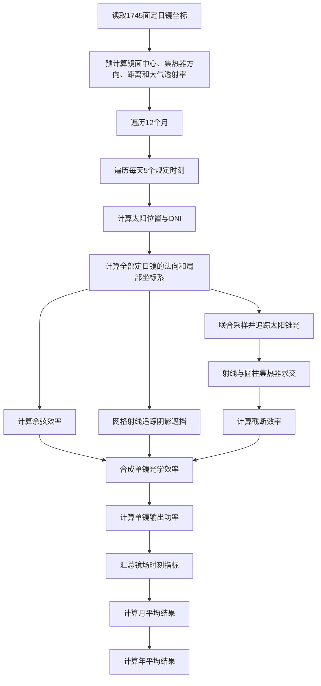

# 第一问

## 1. 问题说明

第一问是一个给定镜场条件下的光学性能计算问题：

> 已知 1745 面定日镜的中心坐标、统一尺寸和安装高度，在题目规定的 60 个时刻下，模拟太阳光照射镜面、经镜面反射并进入集热器的过程，计算各月平均光学效率、平均余弦效率、平均阴影遮挡效率、平均截断效率、镜场平均输出热功率及单位镜面面积平均输出热功率，并进一步得到全年平均结果。

本问采用的最终建模路线为：

| 模块 | 采用方法 |
| --- | --- |
| 太阳位置 | 题目附录中的太阳位置公式 |
| DNI | 题目附录中的法向直接辐射辐照度公式 |
| 镜面姿态 | 三维向量反射定律 |
| 余弦效率 | 太阳方向与镜面法向的点积 |
| 阴影遮挡效率 | 镜面规则网格采样 + 射线与矩形求交 |
| 大气透射率 | 题目给定的经验公式 |
| 截断效率 | 镜面位置与太阳锥光联合采样 + 射线与圆柱求交 |
| 单镜输出功率 | 各项效率相乘 |
| 镜场输出功率 | 1745 面定日镜输出功率求和 |
| 月均、年均结果 | 对题目规定的 60 个时刻等权平均 |

完整计算流程如下：



---

## 2. 模型合理性

本方案的主干路线与官方讲评及国一 A0127 方案采用的方法一致，区别主要在于具体的数值实现方式。

| 计算模块 | 本方案 | 官方讲评或优秀论文常用方法 | 结论 |
| --- | --- | --- | --- |
| 镜面法向 | 太阳方向与集热器方向的角平分线 | 由入射、反射向量求镜面法向 | 原理一致 |
| 镜面空间姿态 | 法向量与局部正交基 | 方位角、俯仰角与旋转矩阵 | 几何等价 |
| 阴影遮挡 | 规则网格与射线—矩形求交 | 网格光线追踪、坐标变换或蒙特卡洛 | 方法一致 |
| 截断效率 | 镜面点与太阳圆盘方向联合采样 | 规则锥光追踪或蒙特卡洛光线追踪 | 方法一致 |
| 塔影 | 忽略 | 官方估算影响低于千分之一 | 可以忽略 |
| 效率合成 | 各分项效率相乘 | 题目规定的乘积模型 | 完全一致 |

阴影遮挡效率与截断效率分别计算，再按照题目给出的效率模型相乘：

$$
\eta_i=
\eta_{\cos,i}
\eta_{sb,i}
\eta_{at,i}
\eta_{\mathrm{trunc},i}
\eta_{\mathrm{ref}}.
$$

没有必要把两者强行合并为一个规模很大的联合仿真。为了检查这一近似，可选择少量有代表性的定日镜进行联合光线追踪，并与分项计算结果比较。

---

## 3. 固定参数与符号

### 3.1 镜场和集热器参数

定日镜数量：

$$
N=1745.
$$

第 $i$ 面定日镜的地面坐标为 $(x_i,y_i)$，安装高度为 $4.5\ \mathrm{m}$，因此镜面中心为

$$
\boldsymbol c_i=(x_i,y_i,4.5).
$$

所有定日镜的尺寸均为

$$
6.2\ \mathrm{m}\times 6.2\ \mathrm{m},
$$

单镜面积为

$$
A_i=A=6.2^2=38.44\ \mathrm{m^2}.
$$

吸收塔位于坐标原点，圆柱形集热器中心为

$$
\boldsymbol C=(0,0,86).
$$

集热器半径为 $4\ \mathrm{m}$，高度为 $8\ \mathrm{m}$，其侧面满足

$$
x^2+y^2=4^2,\qquad 82\le z\le 90.
$$

镜面反射率取

$$
\eta_{\mathrm{ref}}=0.92.
$$

场址纬度和海拔分别为

$$
\varphi=39.4^\circ,\qquad H=3\ \mathrm{km}.
$$

### 3.2 规定计算时刻

题目要求计算每月 21 日以下五个当地时间：

$$
9{:}00,\quad 10{:}30,\quad 12{:}00,\quad 13{:}30,\quad 15{:}00.
$$

全年共计算

$$
12\times 5=60
$$

个时刻。

### 3.3 方向约定

- $\boldsymbol s$：从定日镜指向太阳的单位向量；
- $-\boldsymbol s$：太阳光实际传播到定日镜时的入射方向；
- $\boldsymbol r_i$：从第 $i$ 面定日镜中心指向集热器中心的单位向量；
- $\boldsymbol n_i$：第 $i$ 面定日镜的单位法向量；
- $\boldsymbol u_i$：镜面水平方向的单位向量；
- $\boldsymbol v_i$：镜面高度方向的单位向量。

程序中必须始终采用同一套方向约定，避免因入射方向符号混乱导致反射方向错误。

---

## 4. 太阳位置与 DNI

对每个规定时刻，按照题目附录依次计算日期序号、太阳赤纬角、太阳时角、太阳高度角、太阳方位角以及 DNI。

太阳时角为

$$
\omega=\frac{\pi}{12}(ST-12),
$$

其中 $ST$ 为以小时表示的当地太阳时，例如 $ST=10.5$ 表示 10:30。

太阳高度角满足

$$
\sin\alpha_s
=
\cos\delta\cos\varphi\cos\omega
+
\sin\delta\sin\varphi.
$$

太阳方位角使用题目附录公式计算，并结合上午、下午确定正确象限。随后按照题目坐标系定义，将太阳高度角和方位角转换为单位向量

$$
\boldsymbol s=(s_x,s_y,s_z).
$$

DNI 按照题目附录给出的经验公式，由太阳高度角和海拔 $H=3\ \mathrm{km}$ 计算。若 DNI 的单位为 $\mathrm{kW/m^2}$，则后续计算得到的单镜功率单位为 $\mathrm{kW}$。

### 4.1 DNI 与镜面截获功率

DNI 表示垂直于太阳光线的平面上单位面积接收到的太阳功率。由于镜面通常没有正对太阳，其对太阳光束的有效投影面积为

$$
A_{\mathrm{proj},i}=A_i\cos\theta_i.
$$

定义余弦效率

$$
\eta_{\cos,i}=\cos\theta_i,
$$

则定日镜在不考虑其他损失时截获的太阳功率为

$$
P_{\mathrm{capture},i}
=
DNI\cdot A_i\cdot\eta_{\cos,i}.
$$

因此不需要逐个模拟真实光子。DNI 给出光束单位横截面积的功率，$A_i\eta_{\cos,i}$ 给出镜面对光束的有效截面积，两者相乘即可得到理论截获功率。

---

## 5. 镜面姿态

### 5.1 指向集热器的方向

第 $i$ 面定日镜中心指向集热器中心的单位向量为

$$
\boldsymbol r_i
=
\frac{\boldsymbol C-\boldsymbol c_i}
{\left\|\boldsymbol C-\boldsymbol c_i\right\|}.
$$

由于镜场坐标和集热器位置固定，$\boldsymbol r_i$ 可以在程序开始时一次性计算。

### 5.2 镜面法向

控制系统使太阳中心光线经过镜面中心反射后指向集热器中心。镜面法向是太阳方向和集热器方向的角平分线：

$$
\boxed{
\boldsymbol n_i
=
\frac{\boldsymbol s+\boldsymbol r_i}
{\left\|\boldsymbol s+\boldsymbol r_i\right\|}
}
$$

设一般入射光传播方向为 $\boldsymbol d_{\mathrm{in}}$，则反射方向为

$$
\operatorname{reflect}
\left(\boldsymbol d_{\mathrm{in}},\boldsymbol n\right)
=
\boldsymbol d_{\mathrm{in}}
-2\left(\boldsymbol d_{\mathrm{in}}\cdot\boldsymbol n\right)\boldsymbol n.
$$

对于太阳中心光线，

$$
\boldsymbol d_{\mathrm{in}}=-\boldsymbol s,
$$

程序必须验证

$$
\operatorname{reflect}(-\boldsymbol s,\boldsymbol n_i)
\approx
\boldsymbol r_i.
$$

### 5.3 镜面局部坐标系

设竖直方向为

$$
\boldsymbol k=(0,0,1).
$$

根据“镜面的上下两条边始终平行于地面”的约束，定义镜面水平方向

$$
\boldsymbol u_i
=
\frac{\boldsymbol k\times\boldsymbol n_i}
{\left\|\boldsymbol k\times\boldsymbol n_i\right\|},
$$

镜面高度方向

$$
\boldsymbol v_i
=
\boldsymbol n_i\times\boldsymbol u_i.
$$

于是 $\boldsymbol u_i,\boldsymbol v_i,\boldsymbol n_i$ 构成镜面的局部正交基。镜面上的任意一点可写为

$$
\boldsymbol q_i(a,b)
=
\boldsymbol c_i
+a\boldsymbol u_i
+b\boldsymbol v_i,
$$

其中

$$
-3.1\le a\le 3.1,\qquad
-3.1\le b\le 3.1.
$$

镜面的四个顶点为

$$
\boldsymbol c_i
\pm 3.1\boldsymbol u_i
\pm 3.1\boldsymbol v_i.
$$

若数值上出现 $\boldsymbol n_i$ 与 $\boldsymbol k$ 近似平行的极端情况，应为局部坐标系设置备用参考轴，避免叉积模长接近零。

---

## 6. 余弦效率

由于 $\boldsymbol s$ 和 $\boldsymbol n_i$ 均为单位向量，第 $i$ 面定日镜的余弦效率为

$$
\boxed{
\eta_{\cos,i}
=
\boldsymbol s\cdot\boldsymbol n_i
}
$$

镜面的理论截获功率为

$$
P_{\mathrm{capture},i}
=
DNI\cdot A_i\cdot\eta_{\cos,i}.
$$

---

## 7. 阴影遮挡效率

阴影遮挡效率同时考虑：

1. 太阳光到达目标镜面以前被其他定日镜挡住的阴影损失；
2. 目标镜面的反射光到达集热器以前被其他定日镜挡住的遮挡损失。

采用规则网格射线追踪法计算。

### 7.1 镜面网格采样

将第 $i$ 面定日镜划分为 $n_g\times n_g$ 个等面积网格，并在每个网格中心取一个采样点：

$$
\boldsymbol q_{ip}
=
\boldsymbol c_i
+a_p\boldsymbol u_i
+b_p\boldsymbol v_i.
$$

所有采样点代表相同面积，因此可以直接通过有效点比例估计效率。

### 7.2 入射阴影判定

从采样点沿着指向太阳的方向发射射线：

$$
\boldsymbol L_s(\lambda)
=
\boldsymbol q_{ip}
+\lambda\boldsymbol s,
\qquad \lambda>0.
$$

若该射线在前方与其他定日镜相交，则采样点看不到太阳，判定为发生入射阴影。

### 7.3 反射遮挡判定

从采样点沿中心太阳光的反射方向发射射线：

$$
\boldsymbol L_r(\lambda)
=
\boldsymbol q_{ip}
+\lambda\boldsymbol r_i,
\qquad \lambda>0.
$$

若射线在到达集热器以前与其他定日镜相交，则判定为发生反射遮挡。

反射遮挡只允许统计满足

$$
0<t<t_{\mathrm{receiver}}
$$

的交点。位于集热器之后的定日镜不能被误判为遮挡物。

### 7.4 合并两种损失

对第 $p$ 个采样点定义

$$
V_{ip}=
\begin{cases}
1, & \text{入射光未被遮挡且反射光未被遮挡},\\
0, & \text{否则}.
\end{cases}
$$

阴影遮挡效率为

$$
\boxed{
\eta_{sb,i}
=
\frac{1}{N_g}
\sum_{p=1}^{N_g}V_{ip}
}
$$

两类损失必须在采样点层面取并集，不能直接把阴影比例和遮挡比例相加，因为同一个采样点可能同时发生两种损失。

### 7.5 塔影处理

根据官方讲评中的估算，吸收塔阴影造成的能量影响低于千分之一，因此本问忽略塔影，只计算定日镜之间的入射阴影和反射遮挡。

---

## 8. 射线与矩形定日镜求交

设待检测射线为

$$
\boldsymbol p(t)=\boldsymbol q+t\boldsymbol d,
$$

待检测的第 $j$ 面定日镜由

$$
\boldsymbol c_j,\quad
\boldsymbol n_j,\quad
\boldsymbol u_j,\quad
\boldsymbol v_j
$$

描述。

射线与镜面所在平面的交点参数为

$$
t=
\frac{
\left(\boldsymbol c_j-\boldsymbol q\right)\cdot\boldsymbol n_j
}{
\boldsymbol d\cdot\boldsymbol n_j
}.
$$

实现时按以下步骤判断：

1. 若 $|\boldsymbol d\cdot\boldsymbol n_j|<\varepsilon$，则射线与镜面近似平行，不相交；
2. 若 $t\le\varepsilon$，则交点不在射线前方，或属于射线起点附近的自相交，应舍弃；
3. 否则计算交点

   $$
   \boldsymbol p=\boldsymbol q+t\boldsymbol d;
   $$

4. 将交点转换到第 $j$ 面镜子的局部坐标：

   $$
   a=(\boldsymbol p-\boldsymbol c_j)\cdot\boldsymbol u_j,
   $$

   $$
   b=(\boldsymbol p-\boldsymbol c_j)\cdot\boldsymbol v_j;
   $$

5. 若

   $$
   |a|\le 3.1+\varepsilon,\qquad
   |b|\le 3.1+\varepsilon,
   $$

   则射线与矩形镜面相交。

检测第 $i$ 面镜子的光线时必须排除 $j=i$，并统一设置较小的数值容差 $\varepsilon$，避免镜面自身被错误识别为遮挡物。

---

## 9. 邻镜搜索与计算加速

若每面定日镜都检查其余 1744 面镜子，阴影遮挡部分的计算量约为

$$
60\times1745\times1744\times N_g,
$$

不能直接使用全量暴力循环。

### 9.1 KDTree 候选筛选

对定日镜中心的平面坐标建立 `cKDTree`，每次只检查一定半径内的候选镜。搜索半径可先取

$$
R_{\mathrm{search}}=50\sim60\ \mathrm{m},
$$

但最终必须通过收敛实验验证，例如比较：

| 搜索半径 | 年平均阴影遮挡效率 |
| ---: | ---: |
| $40\ \mathrm{m}$ | 待计算 |
| $60\ \mathrm{m}$ | 待计算 |
| $80\ \mathrm{m}$ | 待计算 |

若 $60\ \mathrm{m}$ 与 $80\ \mathrm{m}$ 的结果已经基本一致，则正式计算可采用 $60\ \mathrm{m}$。

候选镜还可以根据太阳方向或集热器方向做二次筛选，只保留真正可能位于射线路径上的镜面。

### 9.2 向量化和编译加速

程序不应为每条射线单独创建 Python 对象，也不应采用五六层纯 Python `for` 循环。核心计算至少应使用以下一种方式：

- NumPy 批量向量化；
- Numba 编译；
- Cython；
- 按时刻或定日镜划分的多进程。

推荐的批量结构为：

```text
一个时刻
  → 一次性计算1745面定日镜的姿态
  → 一次性生成全部镜面的规则网格点
  → 按镜面批量筛选和检查候选邻镜
  → 批量完成射线—矩形和射线—圆柱求交
```

---

## 10. 大气透射率

第 $i$ 面定日镜中心到集热器中心的距离为

$$
d_{HR,i}
=
\left\|\boldsymbol C-\boldsymbol c_i\right\|.
$$

大气透射率按照题目给定的经验公式计算：

$$
\boxed{
\eta_{at,i}
=
0.99321
-0.0001176d_{HR,i}
+1.97\times10^{-8}d_{HR,i}^2
}
$$

问题一中定日镜位置和集热器位置固定，因此 $d_{HR,i}$ 与 $\eta_{at,i}$ 均可以在程序开始时预计算，不需要在 60 个时刻重复求值。

---

## 11. 截断效率

截断效率表示定日镜反射出去的光线中，最终命中圆柱形集热器侧面的比例。计算时需要同时考虑：

1. 定日镜具有有限面积；
2. 太阳具有有限角半径，不是理想点光源；
3. 平面镜不会把全部光线汇聚到同一个点；
4. 集热器的半径和高度有限。

本方案采用镜面位置和太阳圆盘方向的联合蒙特卡洛采样或 Sobol 准随机采样。每个四维样本直接生成一条光线，避免构造“所有镜面点 $\times$ 所有太阳方向”的笛卡尔积。

### 11.1 镜面位置采样

生成

$$
\xi_1,\xi_2\sim U(0,1),
$$

并令

$$
a=6.2(\xi_1-0.5),\qquad
b=6.2(\xi_2-0.5).
$$

镜面上的均匀采样点为

$$
\boldsymbol q
=
\boldsymbol c_i
+a\boldsymbol u_i
+b\boldsymbol v_i.
$$

### 11.2 太阳圆盘方向采样

围绕太阳中心方向 $\boldsymbol s$ 构造两个与其正交的单位向量

$$
\boldsymbol e_1,\boldsymbol e_2.
$$

设太阳角半径为 $\theta_\odot$。生成

$$
\xi_3,\xi_4\sim U(0,1),
$$

取

$$
\rho=\theta_\odot\sqrt{\xi_3},\qquad
\phi=2\pi\xi_4.
$$

$\sqrt{\xi_3}$ 用于保证样本在太阳视圆面内近似按面积均匀分布。太阳采样方向可构造为

$$
\boldsymbol s_k
=
\operatorname{normalize}
\left[
\cos\rho\,\boldsymbol s
+
\sin\rho
\left(
\cos\phi\,\boldsymbol e_1
+
\sin\phi\,\boldsymbol e_2
\right)
\right].
$$

### 11.3 反射方向

第 $k$ 条采样光线的入射传播方向为

$$
\boldsymbol d_{\mathrm{in},k}=-\boldsymbol s_k.
$$

反射方向为

$$
\boxed{
\boldsymbol d_{\mathrm{out},k}
=
\boldsymbol d_{\mathrm{in},k}
-2
\left(
\boldsymbol d_{\mathrm{in},k}\cdot\boldsymbol n_i
\right)
\boldsymbol n_i
}
$$

需要注意：定日镜法向 $\boldsymbol n_i$ 由太阳圆盘中心方向确定，不会针对每一条采样锥光重新调整。

---

## 12. 射线与圆柱集热器求交

反射射线为

$$
\boldsymbol p(t)
=
\boldsymbol q+t\boldsymbol d_{\mathrm{out}},
\qquad t>0.
$$

记

$$
\boldsymbol q=(q_x,q_y,q_z),\qquad
\boldsymbol d_{\mathrm{out}}=(d_x,d_y,d_z).
$$

将射线代入圆柱侧面方程

$$
(q_x+td_x)^2+(q_y+td_y)^2=16,
$$

得到

$$
At^2+Bt+C=0,
$$

其中

$$
A=d_x^2+d_y^2,
$$

$$
B=2(q_xd_x+q_yd_y),
$$

$$
C=q_x^2+q_y^2-16.
$$

判定步骤如下：

1. 若 $A$ 近似为零，则射线近似平行于圆柱轴，不能命中圆柱侧面；
2. 计算判别式 $\Delta=B^2-4AC$，若 $\Delta<0$，则不相交；
3. 计算两个实根，取其中最小的正根 $t_{\mathrm{hit}}$；
4. 计算交点高度

   $$
   z_{\mathrm{hit}}=q_z+t_{\mathrm{hit}}d_z;
   $$

5. 若

   $$
   82\le z_{\mathrm{hit}}\le90,
   $$

   则射线命中集热器侧面，否则判定为截断损失。

若联合采样 $N_r$ 条光线，其中 $N_{\mathrm{hit}}$ 条命中集热器，则

$$
\boxed{
\eta_{\mathrm{trunc},i}
=
\frac{N_{\mathrm{hit}}}{N_r}
}
$$

推荐使用 Sobol 准随机序列，并固定采样设计，使结果稳定、可复现，且不同镜面之间的比较更加公平。

---

## 13. 单镜效率与输出功率

第 $i$ 面定日镜在时刻 $t$ 的总光学效率为

$$
\boxed{
\eta_i(t)
=
\eta_{\cos,i}(t)
\eta_{sb,i}(t)
\eta_{at,i}
\eta_{\mathrm{trunc},i}(t)
\eta_{\mathrm{ref}}
}
$$

最终进入集热器的单镜功率为

$$
\boxed{
P_i(t)
=
DNI(t)\,A_i\,\eta_i(t)
}
$$

能量传递链为：

```text
DNI × 镜面真实面积
        ↓ 余弦投影损失
镜面能够截获的太阳功率
        ↓ 入射阴影和反射遮挡损失
有效镜面所贡献的反射功率
        ↓ 镜面反射损失
离开镜面的功率
        ↓ 大气传播损失
到达集热器附近的功率
        ↓ 截断损失
最终进入集热器的功率
```

其中，落到有效镜面区域的功率可以写为

$$
P_{\mathrm{effective\ incident},i}
=
DNI\cdot A_i
\cdot\eta_{\cos,i}
\cdot\eta_{sb,i}.
$$

### 13.1 能量算例

假设某面定日镜在某时刻满足

$$
DNI=0.9\ \mathrm{kW/m^2},\quad
\eta_{\cos}=0.80,\quad
\eta_{sb}=0.90,
$$

$$
\eta_{\mathrm{ref}}=0.92,\quad
\eta_{at}=0.97,\quad
\eta_{\mathrm{trunc}}=0.95.
$$

则：

| 阶段 | 功率 |
| --- | ---: |
| 正对太阳时的理论功率 | $0.9\times38.44=34.60\ \mathrm{kW}$ |
| 余弦投影后 | $34.60\times0.80=27.68\ \mathrm{kW}$ |
| 阴影遮挡后 | $27.68\times0.90=24.91\ \mathrm{kW}$ |
| 镜面反射后 | $24.91\times0.92=22.91\ \mathrm{kW}$ |
| 大气传播后 | $22.91\times0.97=22.22\ \mathrm{kW}$ |
| 截断以后 | $22.22\times0.95=21.11\ \mathrm{kW}$ |

因此该定日镜最终送入集热器的功率约为

$$
P_i\approx21.11\ \mathrm{kW}.
$$

---

## 14. 镜场时刻指标

镜场总镜面面积为

$$
A_{\mathrm{total}}
=
\sum_{i=1}^{1745}A_i
=
1745\times38.44.
$$

某时刻的镜场输出功率为

$$
\boxed{
E_{\mathrm{field}}(t)
=
\sum_{i=1}^{1745}P_i(t)
=
DNI(t)
\sum_{i=1}^{1745}A_i\eta_i(t)
}
$$

时刻平均余弦效率为

$$
\overline{\eta}_{\cos}(t)
=
\frac{
\sum_i A_i\eta_{\cos,i}(t)
}{
\sum_i A_i
}.
$$

同理可计算

$$
\overline{\eta}_{sb}(t),\qquad
\overline{\eta}_{\mathrm{trunc}}(t).
$$

时刻平均光学效率为

$$
\boxed{
\overline{\eta}_{\mathrm{opt}}(t)
=
\frac{
\sum_i A_i\eta_i(t)
}{
\sum_i A_i
}
}
$$

由于第一问中所有定日镜面积相同，上述面积加权平均与算术平均相同。但在程序结构中仍建议保留面积加权形式，以便后续问题直接复用。

需要特别注意：

$$
\overline{\eta}_{\mathrm{opt}}
\ne
\overline{\eta}_{\cos}
\overline{\eta}_{sb}
\overline{\eta}_{at}
\overline{\eta}_{\mathrm{trunc}}
\eta_{\mathrm{ref}}.
$$

正确做法是先计算每面定日镜的效率乘积，再对单镜总效率做面积加权平均。

单位镜面面积输出功率为

$$
\boxed{
q(t)
=
\frac{E_{\mathrm{field}}(t)}
{A_{\mathrm{total}}}
}
$$

---

## 15. 月平均与年平均

设第 $m$ 月第 $k$ 个规定时刻的镜场输出功率为 $E_{m,k}$。第 $m$ 月五个时刻的平均输出功率为

$$
\overline E_m
=
\frac{1}{5}
\sum_{k=1}^{5}E_{m,k}.
$$

其他效率指标也先在各时刻完成镜场平均，再对五个时刻等权平均。

全年平均输出功率为

$$
\overline E_{\mathrm{year}}
=
\frac{1}{12}
\sum_{m=1}^{12}\overline E_m
=
\frac{1}{60}
\sum_{m=1}^{12}
\sum_{k=1}^{5}E_{m,k}.
$$

不能用

$$
\text{平均 DNI}\times\text{平均光学效率}
$$

代替平均功率。必须先在每个时刻计算

$$
E(t)
=
DNI(t)\sum_iA_i\eta_i(t),
$$

再对 $E(t)$ 求平均。

---

## 16. 结果表设计

### 16.1 月平均结果表

| 月份 | 平均光学效率 | 平均余弦效率 | 平均阴影遮挡效率 | 平均截断效率 | 平均输出热功率/MW | 单位面积平均输出热功率/$(\mathrm{kW/m^2})$ |
| ---: | ---: | ---: | ---: | ---: | ---: | ---: |
| 1 |  |  |  |  |  |  |
| 2 |  |  |  |  |  |  |
| 3 |  |  |  |  |  |  |
| 4 |  |  |  |  |  |  |
| 5 |  |  |  |  |  |  |
| 6 |  |  |  |  |  |  |
| 7 |  |  |  |  |  |  |
| 8 |  |  |  |  |  |  |
| 9 |  |  |  |  |  |  |
| 10 |  |  |  |  |  |  |
| 11 |  |  |  |  |  |  |
| 12 |  |  |  |  |  |  |

### 16.2 年平均结果表

| 年平均光学效率 | 年平均余弦效率 | 年平均阴影遮挡效率 | 年平均截断效率 | 年平均输出热功率/MW | 单位面积年平均输出热功率/$(\mathrm{kW/m^2})$ |
| ---: | ---: | ---: | ---: | ---: | ---: |
|  |  |  |  |  |  |

---

## 17. 程序模块设计

实际代码统一放在项目的 `src/` 下：

```text
src/
├── solve_q1.py
└── heliostat/
    ├── config.py
    ├── io.py
    ├── solar.py
    ├── geometry.py
    ├── shadow.py
    ├── truncation.py
    └── evaluator.py
```

各模块职责如下：

| 模块 | 主要职责 |
| --- | --- |
| `config.py` | 保存塔、集热器、镜面参数以及可调数值精度 |
| `io.py` | 读取坐标附件；输出逐时刻、月均、年均和运行配置 |
| `solar.py` | 根据月份、时刻、纬度和海拔计算太阳方向与 DNI |
| `geometry.py` | 预计算镜场固定量；计算镜面姿态、余弦效率和反射误差 |
| `shadow.py` | 建立 KDTree；筛选候选镜；完成射线—矩形求交和阴影遮挡计算 |
| `truncation.py` | 生成 Sobol 样本；完成太阳锥光追踪和射线—有限圆柱求交 |
| `evaluator.py` | 合成各项效率；计算单镜和镜场指标；完成月均、年均汇总 |
| `solve_q1.py` | 组织 60 个时刻的计算流程、命令行参数和结果写出 |

---

## 18. 总体伪代码

```python
load mirror_xy

receiver_center = [0.0, 0.0, 86.0]
receiver_radius = 4.0
receiver_z_min = 82.0
receiver_z_max = 90.0

mirror_centers = [
    [x_i, y_i, 4.5]
    for x_i, y_i in mirror_xy
]

mirror_area = 6.2 * 6.2
reflectivity = 0.92

# 固定量预计算
receiver_direction = normalize(
    receiver_center - mirror_centers,
    axis=1,
)

distance = norm(
    receiver_center - mirror_centers,
    axis=1,
)

atmospheric_efficiency = calc_eta_at(distance)
kdtree = build_kdtree(mirror_xy)
sobol_samples = build_fixed_sobol_samples()

all_records = []

for month in range(1, 13):
    monthly_records = []

    for time in [9.0, 10.5, 12.0, 13.5, 15.0]:
        sun_direction, dni = calc_sun(month, time)

        # 一次性计算全部定日镜姿态
        normal = normalize(
            sun_direction + receiver_direction,
            axis=1,
        )

        width_axis, height_axis = build_basis(normal)
        cosine_eff = normal @ sun_direction

        # 阴影遮挡依赖同一时刻全部定日镜的姿态
        shadow_block_eff = calc_shadow_block_batch(
            sun_direction=sun_direction,
            receiver_direction=receiver_direction,
            mirror_centers=mirror_centers,
            normal=normal,
            width_axis=width_axis,
            height_axis=height_axis,
            kdtree=kdtree,
        )

        trunc_eff = calc_truncation_batch(
            mirror_centers=mirror_centers,
            normal=normal,
            width_axis=width_axis,
            height_axis=height_axis,
            sun_direction=sun_direction,
            receiver_center=receiver_center,
            receiver_radius=receiver_radius,
            receiver_z_min=receiver_z_min,
            receiver_z_max=receiver_z_max,
            samples=sobol_samples,
        )

        optical_eff = (
            cosine_eff
            * shadow_block_eff
            * atmospheric_efficiency
            * trunc_eff
            * reflectivity
        )

        mirror_power = dni * mirror_area * optical_eff
        field_power = sum(mirror_power)

        record = {
            "month": month,
            "time": time,
            "dni": dni,
            "optical_eff": weighted_mean(optical_eff, mirror_area),
            "cosine_eff": weighted_mean(cosine_eff, mirror_area),
            "shadow_block_eff": weighted_mean(
                shadow_block_eff,
                mirror_area,
            ),
            "trunc_eff": weighted_mean(trunc_eff, mirror_area),
            "field_power": field_power,
            "unit_area_power": (
                field_power / (1745 * mirror_area)
            ),
        }

        monthly_records.append(record)
        all_records.append(record)

    write_monthly_average(monthly_records)

write_annual_average(all_records)
write_result_tables()
```

---

## 19. 分阶段实现

第一版程序不直接使用最高采样精度，而是按以下阶段逐步实现。

### 阶段一：太阳位置、DNI、镜面姿态和余弦效率

首先实现太阳位置、DNI、集热器方向、镜面法向和局部坐标系，并验证

$$
\left\|
\operatorname{reflect}(-\boldsymbol s,\boldsymbol n_i)
-\boldsymbol r_i
\right\|
<10^{-8}.
$$

这一步不正确时，不进入后续模块。

### 阶段二：大气透射率和镜面反射率

加入 $\eta_{at}$ 和 $\eta_{\mathrm{ref}}$，得到“没有阴影遮挡且反射光全部命中集热器”时的理论上界。

### 阶段三：阴影遮挡

先使用较低分辨率网格验证射线—矩形求交和并集逻辑，再逐步提高网格分辨率。

### 阶段四：截断效率

先用少量联合采样光线验证反射和射线—圆柱求交，再提高样本量并进行收敛实验。

### 建议精度配置

| 使用阶段 | 阴影网格 | 单镜截断光线数 | 计算范围 |
| --- | ---: | ---: | --- |
| 调试版本 | $5\times5$ | 32 | 一个时刻或少量镜子 |
| 初始完整版本 | $8\times8$ 或 $10\times10$ | 64 或 128 | 全部 60 个时刻 |
| 最终验证版本 | $15\times15$ 或 $20\times20$ | 128 或 256 | 全部 60 个时刻 |
| 局部高精度检查 | $20\times20$ 或更高 | 512 | 少量代表性镜子 |

512 条光线可用于少量代表性镜子的精度检查，没有必要默认对所有“镜子—时刻”状态都使用 512 条光线。

---

## 20. 正确性与收敛性检查

程序至少需要通过以下检查。

### 20.1 反射方向检查

对每面定日镜验证

$$
\left\|
\operatorname{reflect}(-\boldsymbol s,\boldsymbol n_i)
-\boldsymbol r_i
\right\|
<10^{-8}.
$$

### 20.2 效率范围检查

所有效率均应满足

$$
0\le\eta\le1.
$$

超出范围通常意味着方向约定、面积归一化或数值容差存在错误。

### 20.3 中心光线检查

镜面中心处的太阳中心光线经反射后必须指向

$$
\boldsymbol C=(0,0,86).
$$

### 20.4 自相交检查

阴影遮挡模块必须排除目标镜面自身，并忽略 $t\le\varepsilon$ 的交点。

### 20.5 集热器前截止检查

反射遮挡交点必须位于目标点和集热器之间，不能把集热器后方的镜面误判为遮挡物。

### 20.6 时间对称性检查

对于整体较对称的镜场，同一个月内以下时刻的镜场整体结果应当相近：

- 9:00 与 15:00；
- 10:30 与 13:30。

由于镜场离散布局未必严格对称，不要求每面定日镜的结果完全相同。

### 20.7 阴影网格收敛检查

| 阴影网格 | 年平均阴影遮挡效率 |
| ---: | ---: |
| $10\times10$ | $x_1$ |
| $15\times15$ | $x_2$ |
| $20\times20$ | $x_3$ |

若 $x_2$ 与 $x_3$ 已经非常接近，则可以认为网格分辨率足够。

### 20.8 截断采样收敛检查

比较 64、128、256 和 512 条光线下的截断效率。正式结果应选择在精度和运行时间之间达到稳定平衡的样本量。

### 20.9 邻镜半径收敛检查

比较 $40\ \mathrm{m}$、$60\ \mathrm{m}$ 和 $80\ \mathrm{m}$ 搜索半径下的阴影遮挡效率，确认候选筛选没有遗漏重要遮挡镜。

### 20.10 联合光线抽查

在近塔、远塔、镜场边缘以及阴影较严重区域分别选择若干定日镜，用联合光线追踪直接检查阴影、遮挡和截断过程，与分项效率乘积进行对照。

---

## 21. 原始 2023A 复现验证

在计算改编参数以前，建议先用原始 2023A 参数和原始附件坐标进行数量级复现：

- 塔高 $80\ \mathrm{m}$；
- 集热器直径 $7\ \mathrm{m}$；
- 定日镜尺寸 $6\ \mathrm{m}\times6\ \mathrm{m}$；
- 安装高度 $4\ \mathrm{m}$。

官方讲评给出的参考结果为：

| 指标 | 官方参考结果 |
| --- | ---: |
| 年平均光学效率 | 0.578 |
| 年平均余弦效率 | 0.757 |
| 年平均阴影遮挡效率 | 0.909 |
| 年平均截断效率 | 0.954 |
| 年平均输出功率 | 35.4 MW |
| 单位面积功率 | $0.564\ \mathrm{kW/m^2}$ |

国一 A0127 使用相近的网格光线追踪和锥光离散方法，报告的结果为：

| 指标 | A0127 参考结果 |
| --- | ---: |
| 年平均光学效率 | 0.60515 |
| 年平均阴影遮挡效率 | 0.925464 |
| 年平均截断效率 | 0.980774 |
| 年平均输出功率 | 36.994507 MW |

两组参考结果并不完全相同，说明采样精度、邻镜筛选和截断近似会带来一定差异。因此复现目标不是机械地得到完全相同的小数，而是确认：

- 余弦效率接近 $0.75$ 的数量级；
- 阴影遮挡效率不能异常接近 1；
- 截断效率应处于合理的较高区间；
- 年平均功率与参考结果处于同一数量级；
- 提高网格、样本量和搜索半径后结果逐渐稳定。

原题数量级复现通过后，再切换到本问参数：

- 集热器中心高度 $86\ \mathrm{m}$；
- 集热器直径 $8\ \mathrm{m}$；
- 定日镜尺寸 $6.2\ \mathrm{m}\times6.2\ \mathrm{m}$；
- 安装高度 $4.5\ \mathrm{m}$。

---

## 22. 最终结论

第一问最终采用

$$
\boxed{
\text{太阳位置解析计算}
+
\text{镜面姿态向量计算}
+
\text{网格阴影遮挡光线追踪}
+
\text{太阳锥光联合采样截断追踪}
}
$$

单面定日镜的完整能量模型为

$$
\boxed{
P_i(t)
=
DNI(t)
\cdot A_i
\cdot\eta_{\cos,i}(t)
\cdot\eta_{sb,i}(t)
\cdot\eta_{at,i}
\cdot\eta_{\mathrm{trunc},i}(t)
\cdot\eta_{\mathrm{ref}}
}
$$

这套方案与官方讲评及优秀论文采用的主流路线一致，不需要更换模型。后续工作的重点是正确实现反射、射线—矩形求交和射线—圆柱求交三个基础几何模块，并通过原题复现、采样收敛和搜索半径收敛证明结果可靠。
