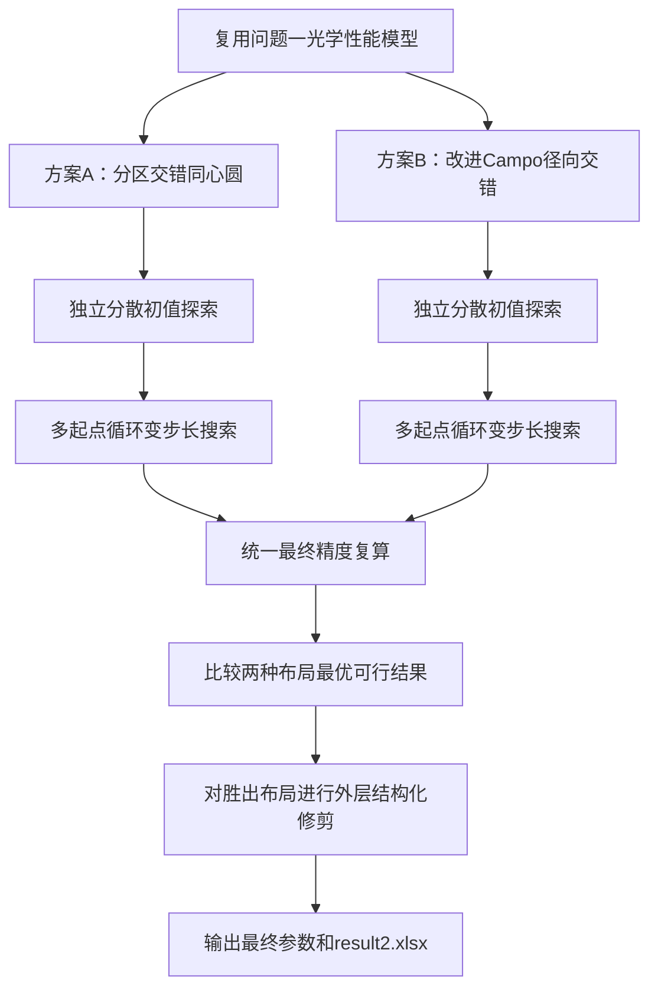
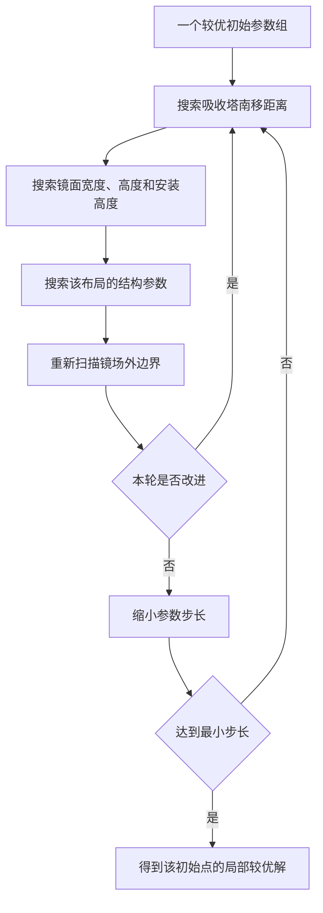

# 第二问技术说明

本文档记录第二问参数化布局的推导背景、搜索流程、计算量控制、输出结构和最终
结果。集中公式见 [`第二问公式说明.md`](第二问公式说明.md)，建模路线见
[`第二问.md`](第二问.md)。

## 1. 总体路线

第二问要求所有定日镜采用统一的镜面尺寸和安装高度，自行确定吸收塔位置、定日镜数量及全部镜位坐标，使镜场年平均输出热功率不低于 $42\ \mathrm{MW}$，并最大化单位镜面面积年平均输出热功率。

本问不把数千面定日镜的坐标作为相互独立的决策变量，也不预先指定某一种布局一定更优，而是并行建立两种有明确几何依据的参数化镜场： $\boxed{\text{方案 A：分区交错同心圆布局}}$ $\boxed{\text{方案 B：改进 Campo 径向交错布局}}$ 两种布局分别独立优化吸收塔位置、统一镜面尺寸、安装高度和各自的布局参数，最后在相同物理模型、约束条件和最终计算精度下比较各自得到的最优可行结果。

该路线取消简单等间距圆环基准方案，也不在固定镜面参数下提前淘汰某一种布局。两种布局均完成一次相对完整但受计算预算约束的独立优化，最终由实际结果决定主布局。

---

## 2. 优化模型

设统一镜面宽度、高度和安装高度分别为 $w,\qquad h,\qquad H.$ 吸收塔地面坐标为 $T=(x_T,y_T).$ 第 $i$ 面定日镜的中心平面坐标为 $(x_i,y_i),\qquad i=1,2,\ldots,N.$ 总镜面面积为 $A_{\mathrm{total}}=Nwh.$ 将候选镜场代入问题一建立的光学效率与输出热功率计算模型，得到年平均输出热功率 $\overline P(\Theta),$ 其中 $\Theta$ 表示塔位置、统一镜面参数和布局参数。

目标函数为 $\boxed{ \max_{\Theta} q(\Theta) = \frac{1000\,\overline P(\Theta)}{Nwh} }.$ 这里 $\overline P$ 以 $\mathrm{MW}$ 计，乘 $1000$ 后换算为
$\mathrm{kW}$，所以 $q$ 的单位为 $\mathrm{kW/m^2}$。

功率约束为 $\boxed{ \overline P(\Theta)\ge42\ \mathrm{MW} }.$ 其余约束为 $2\le h\le w\le8,$ $2\le H\le6, \qquad H\ge\frac h2,$ $\sqrt{(x_i-x_j)^2+(y_i-y_j)^2}>w+5,$ $x_i^2+y_i^2\le350^2,$ $\sqrt{(x_i-x_T)^2+(y_i-y_T)^2}\ge100.$ 为避免浮点误差使严格距离约束失效，布局生成时采用 $d_{\mathrm{safe}}=w+5+\varepsilon,$ 其中 $\varepsilon$ 为正的安全余量。正式交付统一取 $\boxed{\varepsilon=0.01\ \mathrm{m}},$ 即在题目下限之外额外保留 1 cm，避免坐标保存和舍入后贴线失效。统一约束检查器仍按题目原始严格不等式进行最终复核。

---

## 3. 两种布局共用的光学评价

对于每一组候选参数，先由对应布局生成器自动产生全部镜位，再代入问题一建立的模型，计算：

- 余弦效率；
- 大气透射率；
- 阴影遮挡效率；
- 截断效率；
- 月平均和年平均输出热功率；
- 单位镜面面积年平均输出热功率。

候选镜场直接代入第一问建立的光学效率与输出热功率模型，不另建代理模型，
也不使用忽略镜间相互作用的单镜独立评分代替全场评价。两种布局统一采用：

- 相同的 60 个规定时刻；
- 相同的余弦、大气透射、阴影遮挡和截断计算方法；
- 相同的几何约束检查；
- 相同的固定 Sobol 样本和随机种子；
- 相近的候选方案评价次数；
- 相同的最终复算精度。

搜索阶段可以在不删除任何物理损失项的前提下，使用较低密度的阴影网格和较少的截断光线控制计算量；同一搜索阶段内，两种布局使用完全相同的数值精度。最终入围方案统一采用问题一的正式精度，即完整 60 个时刻、$15\times15$ 阴影网格和 256 条截断光线复算。

---

## 4. 方案 A：分区交错同心圆布局

### 4.1 吸收塔位置

利用场地和全年太阳运动的东西对称性，第一阶段令 $x_T=0,\qquad y_T\le0,$ 只搜索吸收塔向南移动的距离。得到较优方案后，再检查 $x_T\in\{-10,-5,0,5,10\}\ \mathrm{m}$ 等少量东西偏移。若偏移没有稳定提升，则保留 $x_T=0$。

### 4.2 分区圆环

以吸收塔为圆心生成圆环，并将镜场划分为近区和远区： $100\le r<R_s,$ $r\ge R_s.$ 近区径向行距为 $\Delta r_1$，远区径向行距为 $\Delta r_2$，并要求 $\Delta r_2\ge\Delta r_1.$ 圆环半径递推为

$$
r_{k+1}
=
\begin{cases}
r_k+\Delta r_1, & r_k<R_s,\\[4pt]
r_k+\Delta r_2, & r_k\ge R_s.
\end{cases}
$$

这对应近塔区域适当加密、远塔区域逐渐放松的布局原则。

### 4.3 周向镜位

半径为 $r_k$ 的圆环上，满足周向安全距离的最大镜子数为 $N_k = \left\lfloor \frac{\pi} {\arcsin\!\left(d_{\mathrm{safe}}/(2r_k)\right)} \right\rfloor.$ 令角度从正 $y$ 轴开始计算，则第 $j$ 个镜位的角度为 $\theta_{k,j} = \frac{2\pi j}{N_k}+\phi_k, \qquad j=0,1,\ldots,N_k-1,$ 其中相邻圆环错开半个角间距：

$$
\phi_k=
\begin{cases}
0, & k\text{ 为奇数},\\[4pt]
\dfrac{\pi}{N_k}, & k\text{ 为偶数}.
\end{cases}
$$

镜位坐标为 $x_{k,j}=x_T+r_k\sin\theta_{k,j},$ $y_{k,j}=y_T+r_k\cos\theta_{k,j}.$ 由于相邻圆环的镜子数可能不同，半角交错不能自动保证跨环距离合法。每生成一圈，都必须精确检查跨环最近距离；若出现冲突，则该组布局参数判为不可行，不能在内部随意移动或删除单镜。

### 4.4 参数向量

方案 A 的参数为 $\boxed{ \Theta_A= \left( y_T,w,h,H,R_s,\Delta r_1,\Delta r_2 \right) }.$

---

## 5. 方案 B：改进 Campo 径向交错布局

Campo 是一种规则但灵活的径向交错布局。原始 Campo 从较密集的径向交错镜场出发，通过圆环分区、分区内固定周向镜数和镜数倍增规则生成大规模规则镜场；随后可以扩大径向间距，在阴影遮挡效率与余弦、截断和大气透射等因素之间取得平衡。[^campo]

本方案采用 Campo 的圆环分区与径向交错规则，并加入随圆环序号逐渐增加的径向行距。

### 5.1 首环

设首环镜子数为整数 $N_1$，首环半径取 $r_1 = \max\left\{ 100,\, \frac{d_{\mathrm{safe}}} {2\sin(\pi/N_1)} \right\}.$ 相邻圆环错开半个角间距，使镜子形成径向交错排列。

### 5.2 Campo 圆环分区

按照 Campo 的规则，将镜场划分为三个圆环区域：

$$
\begin{aligned}
\text{区域 1：}&\quad r_1\le r<2r_1,\\
\text{区域 2：}&\quad 2r_1\le r<4r_1,\\
\text{区域 3：}&\quad r\ge4r_1.
\end{aligned}
$$

各区域单圈镜子数分别为 $N_1,\qquad 2N_1,\qquad 4N_1,$ 相应周向角间距依次减半。当圆环半径增大到能够在相邻镜位之间插入新镜子时，进入下一分区。分区内保持相同的周向镜子数，相邻行继续采用半角交错。

### 5.3 渐增径向行距

令第 $k$ 行与第 $k+1$ 行之间的径向间距为 $D_k=D_1+g(k-1), \qquad g\ge0,$ 则 $r_{k+1}=r_k+D_k.$ 其中：

- $D_1$ 控制近塔区域的初始密度；
- $g$ 控制径向行距向外围增大的速度；
- $N_1$ 决定首环及后续 Campo 分区的基本周向结构。

当半径递推跨越 $2r_1$ 或 $4r_1$ 时，切换到对应 Campo 分区并增加单圈镜子数。每生成一圈，仍由统一约束检查器复核实际中心距离，不能假定分区公式必然满足改编题的 $w+5$ 通道约束。

### 5.4 参数向量

方案 B 的参数为 $\boxed{ \Theta_B= \left( y_T,w,h,H,N_1,D_1,g \right) }.$ 其中 $N_1$ 为整数参数，其余为连续参数。

---

## 6. 偏心吸收塔下的场地裁剪

两种布局均以吸收塔为圆心生成圆环，但场地圆以坐标原点为圆心。当 $y_T<0$ 时，塔心圆环与场地圆不再同心，外围圆环可能只有一部分位于场地内。

所有候选镜位均逐点检查 $x_i^2+y_i^2\le350^2.$ 越过场地边界的镜位按东西对称方式成对删除，因此外层可能表现为对称圆弧，而不一定是完整圆环。裁剪后重新检查塔周禁区和镜间距，确保剩余镜位整体合法。

---

## 7. 镜子数量与镜场外边界

镜子总数 $N$ 不作为独立连续变量交给优化算法，而由布局参数、场地裁剪和镜场外边界共同确定。

给定一组参数后，按照圆环半径由内向外生成镜场。设前 $K$ 个合法圆环或圆弧构成的镜场为 $S_K$，则 $\overline P_K=\overline P(S_K),$ $q_K= \frac{\overline P_K} {N_Kwh}.$ 先以较大的圆环步幅确定功率接近 $42\ \mathrm{MW}$ 的范围，再重点评价 $K-2,\quad K-1,\quad K,\quad K+1,\quad K+2.$ 在满足 $\overline P_K\ge42\ \mathrm{MW}$ 的候选中选择 $q_K$ 最大者。不能默认第一次超过 $42\ \mathrm{MW}$ 的镜场就是最优方案，因为新增外圈对总功率和单位面积功率的影响需要由完整光学模型决定。

若场地内所有合法镜位仍不能达到 $42\ \mathrm{MW}$，则该组布局参数判为不可行。

---

## 8. 两种布局的独立优化

两种布局分别采用 $\boxed{ \text{参数范围估计} + \text{分散初值探索} + \text{多起点循环变步长搜索} }.$ 不使用差分进化、粒子群或遗传算法作为正式主算法。

### 8.1 分散初值探索

分别在 $\Theta_A$ 和 $\Theta_B$ 的参数范围内，使用正交设计或 Sobol 低差异点选取有限数量的分散参数组。

每一个几何合法的参数组均代入问题一的完整光学模型进行评价。每种布局分别保留若干个：

- 已满足 $42\ \mathrm{MW}$ 且单位面积功率较高的方案；
- 或功率接近 $42\ \mathrm{MW}$、仍具有优化价值的方案。

这些方案作为后续局部搜索的多个独立初始点。

### 8.2 循环分块搜索

每种布局均分为三个参数块。

参数块一为吸收塔位置： $y_T.$ 参数块二为统一镜面参数： $w,\qquad h,\qquad H.$ 参数块三为布局参数。方案 A 使用 $R_s,\qquad\Delta r_1,\qquad\Delta r_2,$ 方案 B 使用 $N_1,\qquad D_1,\qquad g.$ 搜索过程为：

搜索不是按照固定顺序只执行一次，而是在参数块之间循环。镜面尺寸变化后，必须重新搜索塔位置和布局间距，因为最低镜间距、周向镜数和径向结构会同时变化。

### 8.3 由粗到细

连续参数可采用三档步长，例如 $\Delta y_T: 20\rightarrow10\rightarrow5\ \mathrm{m},$ $\Delta w,\Delta h: 0.5\rightarrow0.2\rightarrow0.1\ \mathrm{m},$ $\Delta H: 0.5\rightarrow0.2\rightarrow0.1\ \mathrm{m}.$ 布局参数也按照相同原则逐级缩小步长。整数参数 $N_1$ 每次检查相邻若干整数。若一整轮参数块搜索没有产生改进，则缩小步长；达到最小步长后停止。

每种布局从多个分散初始点独立运行循环变步长搜索，以降低单一初值导致局部停滞的风险。

---

## 9. 可行性和比较规则

几何非法方案在调用光学模型前直接淘汰。对于几何合法方案：

1. 满足 $42\ \mathrm{MW}$ 的方案优于不满足者；
2. 两个方案均满足约束时，单位面积功率较高者优先；
3. 两个方案均不满足约束时，年平均功率较高者优先；
4. 若结果差异接近数值误差，则提高精度重新计算。

两种布局分别得到 $q_A^\star, \qquad q_B^\star.$ 最终选择 $\boxed{ q^\star=\max\left(q_A^\star,q_B^\star\right) }$ 对应的布局作为问题二最终方案。

若两种布局的单位面积功率几乎相同，则优先选择：

- 参数更少；
- 几何约束更稳定；
- 镜场更规则；
- 对参数小幅扰动不敏感；
- 更容易复现和解释；

的方案。

---

## 10. 最外层结构化修剪

仅对胜出布局进行最终修剪。候选删除对象限定为最外层或次外层的东西对称镜位对 $(x,y),\qquad(-x,y).$ 删除后重新调用问题一完整模型，计算真实的全场功率和单位面积功率。只有同时满足 $\overline P_{\mathrm{new}}\ge42\ \mathrm{MW}$ 和 $q_{\mathrm{new}}>q_{\mathrm{old}}$ 时才接受删除。

不能只按照单镜自身输出功率排序后任意删镜，因为删除镜子还会改变其他镜子的阴影遮挡关系。

---

## 11. 计算量控制

两种布局均需要反复调用问题一光学模型，计算量是本问的主要困难。采用以下措施控制运行时间：

1. 在调用光学模型前完成尺寸、触地、场地、禁区和镜间距检查；
2. 使用 Sobol 低差异点减少初始参数组合数量；
3. 两种布局采用相近的初始样本数和总评价次数；
4. 搜索阶段使用统一的探索精度，最终候选统一高精度复算；
5. 缓存 60 个时刻的太阳方向、DNI 和固定 Sobol 光线样本；
6. 使用 KD 树缩小候选遮挡镜范围；
7. 缓存相同参数和相同坐标的评价结果；
8. 不同初始点和不同布局之间可以并行计算；
9. 只在胜出布局上执行计算量较大的逐对结构化修剪。

这些措施不改变问题一的物理模型，只减少几何非法方案、重复计算和不必要的高精度评价。

---

## 12. 最终输出

最终需要输出：

- 胜出的布局类型；
- 吸收塔坐标；
- 统一镜面宽度和高度；
- 统一安装高度；
- 镜子总数和总镜面面积；
- 全部镜位坐标；
- 各月平均效率和输出热功率；
- 年平均输出热功率；
- 单位镜面面积年平均输出热功率；
- 按题目模板填写的 `result2.xlsx`。

正式交付保留四幅核心图：

1. 两种布局的平面分布与单镜年平均输出图；
2. 两种布局主要性能指标对比图；
3. 两种布局月平均性能对比图；
4. 两种布局三维镜场与代表性中心光路图。

同时将共享光学核心、布局生成、搜索、验证、结果输出和绘图代码合并为 `outputs/q2/01_第二问完整代码.py`，形成与第一问相同的单文件展示稿。正式坐标、月年平均结果、论文表、加密验证、提交用 Excel 和四张图片均按编号平铺在 `outputs/q2/`，不把搜索中间阶段混入交付目录。

---

## 13. 实际计算结果与最终方案

题目中的 $42\ \mathrm{MW}$ 严格表示镜场年平均输出热功率下限，而不是另行计算的瞬时额定功率。最终结果同时报告约束目标、计算值、功率余量和真正的优化目标。

两种布局均采用问题一最终精度完成复算。分区交错同心圆的较优可行方案与经过中等步长细化、塔东西偏移复核和外层对称修剪后的 Campo 方案对比如下。

| 指标 | 分区交错同心圆 | 改进 Campo |
| --- | ---: | ---: |
| 塔坐标 $(x_T,y_T)$ / m | $(0.000,-30.394)$ | $(0.000,-181.800)$ |
| 镜面宽×高 / m | $6.810\times6.711$ | $6.747\times6.229$ |
| 安装高度 / m | $4.828$ | $4.111$ |
| 安全距离附加量 / m | 0.010 | 0.010 |
| 镜子数 | 1446 | 1469 |
| 总镜面面积 / $\mathrm{m^2}$ | 66090.183 | 61732.830 |
| 年平均输出热功率 / MW | 42.146789 | 42.044238 |
| 相对 42 MW 的功率余量 / MW | 0.146789 | 0.044238 |
| 单位镜面面积年平均输出热功率 / $\mathrm{kW/m^2}$ | 0.637716 | **0.681068** |

两种方案均满足 $\overline P\ge42\ \mathrm{MW}.$ 改进 Campo 方案的单位面积目标值比同心圆方案高约 $6.80\%$，同时总镜面面积减少约 $6.59\%$，因此选择改进 Campo 作为最终布局。

最终 Campo 参数为 $\boxed{ x_T=0,\quad y_T=-181.800\ \mathrm{m},\quad w=6.747\ \mathrm{m},\quad h=6.229\ \mathrm{m},\quad H=4.111\ \mathrm{m} }$ 以及 $\boxed{ N_1=72,\quad D_1=11.860\ \mathrm{m},\quad g=0.17357\ \mathrm{m/环}. }$ 最终镜场含 1469 面定日镜、28 个有效圆环或圆弧，总镜面面积为 $A_{\mathrm{total}}=61732.830\ \mathrm{m^2}.$ 在问题一最终精度 $15\times15$ 阴影网格和每镜每时刻 256 条截断光线下， $\boxed{ \overline P=42.044238\ \mathrm{MW}, \qquad \overline P-42=0.044238\ \mathrm{MW}, \qquad q=0.681068\ \mathrm{kW/m^2}. }$ 年平均综合光学效率为 $0.702056$，余弦效率、阴影遮挡效率、大气透射率和截断效率分别为 $0.843003,\qquad 0.967956,\qquad 0.959625,\qquad 0.976914.$ 最终 Campo 镜场的精确最小镜心距离为 $11.756757380\ \mathrm{m}$，比题目要求的 $w+5=11.746757380\ \mathrm{m}$ 多 $0.010000000\ \mathrm{m}$；坐标保留至 4 位小数后仍有约 $0.00993\ \mathrm{m}$ 余量。

为检查较小功率余量是否由离散误差造成，又采用 $20\times20$ 阴影网格、512 条截断光线和 80 m 邻镜半径进行加密复算，得到 $\overline P_{\mathrm{dense}}=42.055115\ \mathrm{MW}, \qquad q_{\mathrm{dense}}=0.681244\ \mathrm{kW/m^2}.$ 加密复算仍满足 $42\ \mathrm{MW}$ 约束，故最终修剪方案在当前数值模型和 1 cm 几何安全余量下稳定可行。全部 1469 个镜位以及提交文件见 `outputs/q2/`。

---

## 14. 本问小结

本问分别建立分区交错同心圆布局和改进 Campo 径向交错布局，不额外设置简单圆环基准方案，也不在固定镜面尺寸下提前淘汰某种布局。两种布局均通过少量参数自动生成全部镜位，分别在完整参数空间内进行分散初值探索，并围绕多个较优初值采用循环变步长搜索，反复调整吸收塔位置、统一镜面参数、布局参数和镜场外边界。

镜子数量不作为独立连续变量，而由布局生成器逐圈产生，并通过扫描 $42\ \mathrm{MW}$ 附近的多个镜场外边界确定。两种布局分别得到较优可行结果后，在相同最终精度和约束口径下比较，选择单位镜面面积年平均输出热功率更高的方案，并对其最外层东西对称镜位进行结构化修剪。

因此，本问最终采用 $\boxed{ \text{两种成熟结构布局独立优化} + \text{统一光学模型评价} + \text{多起点循环变步长搜索} + \text{实际结果择优} }.$ [^campo]: F. J. Collado and J. Guallar, “Campo: Generation of regular heliostat fields,” *Renewable Energy*, vol. 46, pp. 49–59, 2012. [https://doi.org/10.1016/j.renene.2012.03.011](https://doi.org/10.1016/j.renene.2012.03.011)
