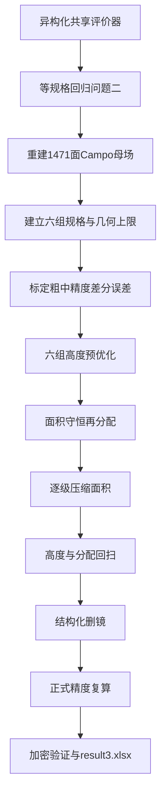

# 第三问技术说明

分组异构评价器、搜索和验证的实现约定

## 1. 代码边界

第三问继续复用 `src/heliostat/` 中的问题一光学核心，不复制太阳位置、镜面
姿态、阴影遮挡或截断公式。共享核心增加逐镜规格数组，但保留问题一、问题二
原有统一规格调用方式。

建议代码结构为：

```text
src/
├── solve_q3.py
└── heliostat/
    ├── geometry.py
    ├── shadow.py
    ├── truncation.py
    ├── q1/solve.py
    └── q3/
        ├── model.py
        ├── evaluate.py
        ├── search.py
        ├── prune.py
        ├── export.py
        └── solve.py
```

各文件职责为：

| 文件 | 责任 |
| --- | --- |
| `model.py` | 1471 面母场、六组映射、规格展开和异构几何检查 |
| `evaluate.py` | 三档精度、异构全场评价、缓存和经验差分校准 |
| `search.py` | 高度扫描、面积守恒转移、面积压缩和候选选择 |
| `prune.py` | 低贡献镜排序、对称镜位识别和删镜复算 |
| `export.py` | CSV、JSON、论文表和 `result3.xlsx` |
| `solve.py` | 命令行编排、烟雾测试、正式复算和加密验证 |

---

## 2. 共享核心异构接口

`prepare_field` 保留原有调用：

```python
prepare_field(mirror_xy, field_config)
```

并增加可选逐镜数组：

```python
prepare_field(
    mirror_xy,
    field_config,
    mirror_widths=widths,
    mirror_heights=heights,
    mirror_center_zs=installation_heights,
)
```

未传数组时，由 `FieldConfig` 中的统一标量填充，因此第一问、第二问无需修改
调用代码。

`PreparedField` 保存：

- `mirror_widths`；
- `mirror_heights`；
- `mirror_center_zs` 对应的三维 `centers`；
- `mirror_areas`；
- `total_mirror_area`。

所有数组必须是一维、长度等于镜子数、有限且为正数。

---

## 3. 阴影遮挡实现

### 3.1 目标镜采样

规则网格先生成归一化坐标，或按 `(width, height)` 缓存实际局部坐标。同组
镜面共享规格时可以复用缓存。

### 3.2 候选镜矩形

射线与镜面矩形求交时，候选镜 \(j\) 使用

```python
half_width = prepared.mirror_widths[j] / 2
half_height = prepared.mirror_heights[j] / 2
```

不能继续读取 `FieldConfig` 的统一宽高。

### 3.3 方向候选范围

预先计算逐镜包围半径和全场最大包围半径。目标镜 \(i\) 使用

```text
(target_radius + maximum_radius) * candidate_margin
```

作为方向垂距上界。

### 3.4 邻域半径

搜索阶段采用 60 m。最终候选完整比较 60 m 和 80 m；冬季 9:00、15:00
增加 100 m 检查。若差异超过经验阈值，正式设置提升到更大邻域。

---

## 4. 截断效率实现

保留同一组四维 Sobol 样本。镜面位置维度先保留为归一化坐标：

```text
u = sample[:, 0] - 0.5
v = sample[:, 1] - 0.5
```

在镜面分块中按逐镜数组广播：

```text
local_width = widths[:, None] * u[None, :]
local_height = heights[:, None] * v[None, :]
```

太阳圆盘方向样本在所有镜面和候选之间保持一致。

---

## 5. 功率和面积加权

逐镜功率必须使用：

```text
mirror_power = DNI * mirror_areas * optical_efficiency
```

每个时刻的分项效率和综合效率分别按 `mirror_areas` 加权。月平均和年平均仍
由现有汇总器对题目规定时刻等权平均。

单镜年平均结果继续保存逐镜效率和功率，用于分组诊断和删镜候选排序。

---

## 6. 回归门槛

异构核心完成后依次执行：

1. 问题一、问题二现有单元测试全部通过；
2. 统一标量调用与等值数组调用产生相同镜心、总面积和逐时刻功率；
3. 1469 面正式配置复现：

```text
P = 42.0442377574 MW
q = 0.6810677214 kW/m²
```

允许的回归误差只来自浮点运算顺序，不能来自模型口径变化。

---

## 7. 母场和分组映射

从 `outputs/q2/07_最终方案摘要.json` 读取问题二 Campo 参数，调用现有
`generate_campo_layout` 确定性重建完整 1471 面、28 环母场。

圆环到组的映射固定为：

```text
1      -> G1
2..5   -> G2
6..11  -> G3
12..14 -> G4
15..20 -> G5
21..28 -> G6
```

程序启动时断言组镜数为：

```text
(72, 269, 283, 224, 357, 266)
```

若问题二参数或生成规则变化导致断言失败，第三问停止，而不是静默沿用错误
分组。

---

## 8. 异构几何检查

固定坐标下预先用 KD 树计算每面镜最近邻距离，得到逐镜和逐组宽度上限。

每个候选在光学评价前检查：

- 数组形状和有限性；
- \(2\le h_i\le w_i\le8\)；
- \(2\le H_i\le6\)；
- \(H_i\ge h_i/2\)；
- 场地边界；
- 塔周 100 m 禁区；
- \(d_{ij}>\max(w_i,w_j)+5+0.01\)。

因为镜面宽度不超过 8 m，只需精确检查中心距不大于约 13.01 m 的镜对。

---

## 9. 精度配置

建议默认配置为：

| 层级 | 月份 | 时刻 | 阴影网格 | 截断光线 | 邻域 |
| --- | --- | --- | ---: | ---: | ---: |
| coarse | 3、6、9、12 月 | 5 个 | \(5\times5\) | 64 | 60 m |
| medium | 12 个月 | 5 个 | \(10\times10\) | 128 | 60 m |
| formal | 12 个月 | 5 个 | \(15\times15\) | 256 | 60 m |
| dense | 12 个月 | 5 个 | \(20\times20\) | 512 | 80 m |

搜索首先标定 coarse 到 medium 的差分误差。正式精度用于最终候选和少量
medium 到 formal 的复核，不把十几个正式评价无条件写死。

当前实现对所有粗精度下可能改善、且经验功率区间未整体落到 42 MW 以下的
候选先执行 medium 评价；只有 medium 仍满足功率约束且真实提高单位面积
输出时才接受。因此经验误差带负责预筛选，不替代参考精度验收。

---

## 10. 搜索状态与缓存

设计状态保存六个尺度和六个高度：

```python
GroupDesign(
    scales=(...),
    heights=(...),
)
```

缓存键必须包含：

- 坐标；
- 逐镜宽度；
- 逐镜高度；
- 逐镜安装高度；
- 塔位和集热器配置；
- 数值精度配置；
- 当前活跃镜集合。

不能只按坐标和统一 `FieldConfig` 缓存。

---

## 11. 搜索动作

### 11.1 高度预优化

按正向、反向顺序对每个 \(H_g\) 测试

```text
H_g - ΔH
H_g
H_g + ΔH
```

建议步长：

```text
0.40 -> 0.20 -> 0.10 m
```

### 11.2 面积守恒再分配

优先测试但不预设结论的方向包括：

```text
G4 <-> G3
G4 <-> G5
G6 <-> G3
G6 <-> G5
```

每个方向均允许反向尝试。面积转移量按总面积比例设置，例如：

```text
0.50% -> 0.20% -> 0.10%
```

### 11.3 面积压缩

对各组尺度分别测试下降，并在必要时测试小幅上升：

```text
0.030 -> 0.015 -> 0.005
```

每一面积层完成后重新执行面积转移和高度回扫。候选始终按稳健功率约束下的
单位面积输出选择，不能只选择面积最小者。

---

## 12. 结构化删镜

从当前单镜年平均功率较低的镜子建立候选池，优先组为 `G4` 和 `G6`，同时
包括第 12 环和最外层。

先识别东西对称镜位对。每轮：

1. 按单镜功率和对进行预排序；
2. 限制本轮最多评价的候选数；
3. 对每个候选删除后执行全场评价；
4. 仅接受满足功率约束且提高 \(q\) 的最好候选；
5. 接受后重新计算排序。

最后的单镜删除是可选边界细化，必须使用更高精度确认。

---

## 13. 命令行和运行模式

烟雾测试只运行少量镜子、月份、时刻和搜索动作，用于验证：

- 母场重建；
- 规格展开；
- 异构几何；
- 光学评价；
- 搜索；
- `result3.xlsx` 输出。

正式运行默认处理完整 1471 面母场。建议提供：

```text
--smoke
--output
--q2-summary
--result3-template
--calibration-candidates
--max-cycles
--prune-rounds
--prune-pairs-per-round
--run-validation
```

烟雾测试输出不得用作论文结果。

---

## 14. 输出文件

建议第三问交付目录为 `outputs/q3/`：

```text
01_第三问完整代码.py
02_分阶段方案比较.json
03_最终逐镜参数与坐标.csv
04_月平均计算结果.csv
05_年平均计算结果.json
06_单镜年平均结果.csv
07_最终方案摘要.json
08_论文结果与验证表.md
09_高精度加密验证.json
10_第三问提交结果.xlsx
```

搜索轨迹和缓存属于运行中间数据，不混入正式交付目录。

---

## 15. 实施顺序



任何阶段若等规格回归、几何合法性或正式功率约束失败，都停止进入后续阶段，
不得用粗精度结果替代正式结论。

---

## 16. 正式运行记录

默认预算的完整搜索已经完成。正式方案保留 1471 面镜子，总镜面面积为
`60777.391 m²`，正式精度结果为：

```text
P = 42.051608 MW
q = 0.691896 kW/m²
```

六组尺度为：

```text
(0.915000, 1.000000, 1.030716, 0.949996, 1.030440, 0.940143)
```

六组安装高度为：

```text
(2.910585, 3.310585, 3.210585, 5.010585, 4.110585, 4.210585) m
```

20×20 阴影网格、512 条截断光线和 80 m 邻域的加密结果为：

```text
P = 42.031084 MW
q = 0.691558 kW/m²
```

把同一加密评价的邻域扩大到 100 m 后结果不变。正式输出位于
`outputs/q3/`，烟雾测试结果未混入该目录。
