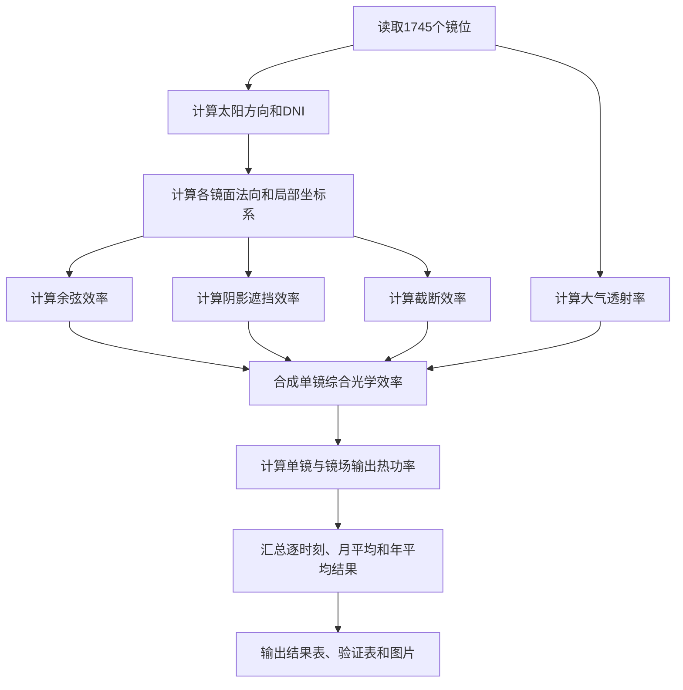

# 第一问

给定定日镜场的光学性能计算方案

本文档说明第一问的建模路线、数值配置、计算结果、验证方法和输出文件。太阳
位置、DNI、镜面姿态、四项效率及月年汇总的完整公式见
[`第一问公式说明.md`](第一问公式说明.md)。

## 1. 本问定位

第一问给定吸收塔、集热器、1745 面定日镜的位置、镜面尺寸和安装高度，要求计算题目规定时刻下的镜场光学效率与输出热功率。

本问属于确定性评价问题，不优化塔位、镜面尺寸、镜子数量或镜位坐标。核心任务是建立一套可复用的全场光学模型，为第二问的布局优化提供统一评价函数。

需要计算：

- 平均余弦效率；
- 平均阴影遮挡效率；
- 平均大气透射率；
- 平均截断效率；
- 平均综合光学效率；
- 镜场输出热功率；
- 单位镜面面积输出热功率；
- 月平均、年平均以及单镜年平均结果。

### 1.1 内容范围

本问围绕固定镜场评价展开：先给出已知参数和统一光学模型，再说明数值离散、
月年汇总、计算结果和收敛验证。射线与矩形、圆柱的详细求交推导记录在
`q1-technical-notes.md`。

---

## 2. 已知参数

镜场包含 $N=1745$ 面定日镜，平面坐标由 `task/A/fj.xlsx` 给出。

定日镜统一尺寸为 $w=h=6.2\ \mathrm{m},$ 单镜面积为 $A_m=wh=38.44\ \mathrm{m^2}.$ 镜面中心安装高度为 $H=4.5\ \mathrm{m}.$ 第 $i$ 面定日镜中心为 $\boldsymbol c_i=(x_i,y_i,4.5).$ 吸收塔位于原点，集热器中心为 $\boldsymbol C=(0,0,86).$ 集热器采用半径 $4\ \mathrm{m}$、高度 $8\ \mathrm{m}$ 的圆柱侧面模型： $x^2+y^2=4^2,\qquad 82\le z\le90.$ 镜面反射率取 $\eta_{\mathrm{ref}}=0.92.$ 计算地点纬度为 $39.4^\circ$，海拔为 $3\ \mathrm{km}$。

---

## 3. 总体计算路线



全年选取每月 21 日的五个当地太阳时： $9{:}00,\quad10{:}30,\quad12{:}00,\quad13{:}30,\quad15{:}00.$ 共计算 $12\times5=60$ 个状态，并对题目规定的这些状态等权平均。

---

## 4. 太阳位置与镜面姿态

每个规定时刻按照题目附录计算太阳高度角、方位角、太阳方向单位向量 $\boldsymbol s$ 以及法向直接辐射强度 $DNI$。其中 $\boldsymbol s$ 定义为从定日镜指向太阳的方向。

第 $i$ 面定日镜指向集热器中心的单位向量为 $\boldsymbol r_i = \frac{\boldsymbol C-\boldsymbol c_i} {\|\boldsymbol C-\boldsymbol c_i\|}.$ 根据镜面反射定律，镜面法向取入射方向与目标反射方向的角平分方向： $\boxed{ \boldsymbol n_i = \frac{\boldsymbol s+\boldsymbol r_i} {\|\boldsymbol s+\boldsymbol r_i\|} }.$ 程序还以 $\boldsymbol n_i$ 为基础构造镜面宽度轴和高度轴，从而将镜面上的二维采样点转换到三维空间。

---

## 5. 各项光学效率

### 5.1 余弦效率

余弦效率为太阳方向与镜面法向的点积： $\boxed{ \eta_{\cos,i}=\boldsymbol n_i\cdot\boldsymbol s }.$ 程序把结果限制在 $[0,1]$ 内，并检查由镜面中心反射的光线是否准确指向集热器中心。

### 5.2 阴影遮挡效率

每面定日镜采用 $15\times15$ 规则网格采样。对每个采样点分别沿太阳入射反方向和集热器反方向发射检测射线：

- 射线先撞到其他定日镜时，记为入射阴影或反射遮挡；
- 两类损失取并集，避免重复扣除同一个采样点；
- 阴影遮挡效率等于未被阻挡采样点所占比例。

为避免对全部镜子两两求交，先根据镜心距离和射线方向筛选可能相交的邻镜，再执行射线与有限矩形镜面的精确求交。

正式计算使用 $60\ \mathrm{m}$ 邻镜搜索半径。

### 5.3 大气透射率

设定日镜中心到集热器中心的距离为 $d_i=\|\boldsymbol C-\boldsymbol c_i\|,$ 则按照题目经验公式计算 $\boxed{ \eta_{\mathrm{at},i} = 0.99321-0.0001176d_i+1.97\times10^{-8}d_i^2 }.$

### 5.4 截断效率

截断效率用于描述反射光未落到圆柱集热器有效侧面的损失。

对每面镜、每个时刻使用 256 条固定 Sobol 联合样本，同时采样：

- 镜面上的入射位置；
- 太阳圆盘内的入射方向。

对每条样本光线重新计算反射方向，并与有限高度的圆柱集热器侧面求交。命中有效侧面的比例即为 $\eta_{\mathrm{trunc},i}.$ 固定 Sobol 样本和随机种子可以降低重复运行之间的数值波动，也便于后续第二问公平比较不同布局。

---

## 6. 综合效率与输出热功率

第 $i$ 面定日镜在一个时刻的综合光学效率为 $\boxed{ \eta_i = \eta_{\cos,i}\, \eta_{\mathrm{sb},i}\, \eta_{\mathrm{at},i}\, \eta_{\mathrm{trunc},i}\, \eta_{\mathrm{ref}} }.$ 单镜输出热功率为 $\boxed{ P_i=DNI\cdot A_m\cdot\eta_i }.$ 镜场总输出热功率为 $\boxed{ P_{\mathrm{field}}=\sum_{i=1}^{N}P_i }.$ 由于第一问所有镜面面积相同，镜场平均光学效率可直接对 1745 面镜子的单镜效率取算术平均。单位镜面面积输出热功率为 $q = \frac{P_{\mathrm{field}}}{NA_m}.$

---

## 7. 月平均与年平均

每个月的五个规定时刻等权平均： $\overline X_m = \frac{1}{5} \sum_{t\in\{9,10.5,12,13.5,15\}}X_{m,t}.$ 年平均对全部 60 个规定状态等权平均： $\overline X_{\mathrm{year}} = \frac{1}{60} \sum_{m=1}^{12} \sum_t X_{m,t}.$ 程序不保存规模很大的“单镜×时刻”完整明细，而是在逐时刻计算过程中累加每面镜子的效率和功率，最终输出 1745 行单镜年平均结果。

---

## 8. 正式数值配置

| 项目 | 正式设置 |
| --- | ---: |
| 计算状态 | 12 个月 × 5 个时刻 |
| 阴影网格 | $15\times15$ |
| 截断光线 | 每镜每时刻 256 条 |
| 邻镜搜索半径 | 60 m |
| 截断分块大小 | 128 |
| Sobol 随机种子 | 2023 |

所有效率均检查是否位于 $[0,1]$，中心光线反射误差必须小于 $10^{-8}$。

---

## 9. 计算结果

第一问的年平均结果为：

| 指标 | 年平均结果 |
| --- | ---: |
| 综合光学效率 | 0.619170 |
| 余弦效率 | 0.761169 |
| 阴影遮挡效率 | 0.929925 |
| 大气透射率 | 0.964959 |
| 截断效率 | 0.992207 |
| 镜场输出热功率 | 40.430243 MW |
| 单位镜面面积输出热功率 | 0.602737 kW/m² |

第一问得到 $40.430243\ \mathrm{MW}$ 并不表示程序未达到第二问的 42 MW 约束。第一问的镜场完全由题目给定，只负责评价；42 MW 是第二问重新设计镜场时必须满足的优化约束。

从月平均结果看，镜场性能随太阳高度呈明显季节变化：6 月单位面积输出最高，为 $0.691289\ \mathrm{kW/m^2}$；12 月最低，为 $0.463453\ \mathrm{kW/m^2}$。

---

## 10. 正确性与收敛验证

自动测试与物理检查包括：

1. 春分日赤纬计算检查；
2. 上午和下午太阳方向对称性检查；
3. 中心光线反射方向检查；
4. 单镜无邻镜时阴影遮挡效率为 1；
5. 增大集热器半径不会降低固定样本下的截断效率；
6. 所有效率范围检查；
7. 题目原始参数回归检查。

主要收敛结果为：

| 验证项目 | 较低精度 | 正式精度 | 较高精度 |
| --- | ---: | ---: | ---: |
| 阴影网格对应年平均阴影效率 | 10×10：0.930130 | 15×15：0.929925 | 20×20：0.929925 |
| 邻镜半径对应年平均阴影效率 | 40 m：0.929925 | 60 m：0.929925 | 80 m：0.929925 |
| 截断光线对应年平均截断效率 | 128：0.992295 | 256：0.992207 | 512：0.992710 |

正式配置已处在稳定区间。切换回原始 2023A 参数后，程序得到年平均输出热功率 $36.997236\ \mathrm{MW}$，与参考结果 $36.994507\ \mathrm{MW}$ 基本一致。

---

## 11. 与第二问的关系

第二问不重新定义另一套光学公式，而是把第一问模型作为统一的候选镜场评价器。

对第二问的任意候选塔位、镜面尺寸、安装高度和镜位坐标，程序只需重新构造镜场几何对象，随后仍按第一问相同方式计算：

- 相同的 60 个规定状态；
- 相同的太阳位置与 DNI；
- 相同的镜面姿态和反射定律；
- 相同的阴影遮挡、透射和截断模型；
- 相同的月平均与年平均口径。

因此，第一问是“固定镜场评价”，第二问是“参数化布局搜索 + 第一问模型评价”。两问结果可以直接比较，不存在口径切换。

---

## 12. 图表与数据索引

以下图表分别记录月平均、年平均、收敛验证和单镜空间分布：

| 编号 | 内容 | 数据或图片来源 |
| --- | --- | --- |
| 表 1-1 | 每月 21 日平均效率及单位面积功率 | `outputs/q1/03_月平均计算结果.csv` |
| 表 1-2 | 年平均光学效率与输出热功率 | `outputs/q1/04_年平均计算结果.json` |
| 表 1-3 | 数值收敛验证 | `outputs/q1/07_论文结果与验证表.md` |
| 图 1-1 | 月平均光学性能与输出热功率 | `outputs/q1/08_月平均光学性能与输出热功率.png` |
| 图 1-2 | 单镜年平均综合光学效率空间分布 | `outputs/q1/09_单镜年平均综合光学效率空间分布.png` |

全部结果结论可追溯到：

| 文件 | 行数或内容 | 支撑内容 |
| --- | ---: | --- |
| `outputs/q1/01_第一问完整代码.py` | 单文件完整程序 | 从坐标读取到结果制图 |
| `outputs/q1/02_逐时刻计算结果.csv` | 60 行 | 12 个月 × 5 个时刻 |
| `outputs/q1/03_月平均计算结果.csv` | 12 行 | 月平均结果 |
| `outputs/q1/04_年平均计算结果.json` | 1 组年平均指标 | 第一问主要结论 |
| `outputs/q1/05_单镜年平均结果.csv` | 1745 行 | 单镜空间分布 |
| `outputs/q1/06_运行配置.json` | 参数和数值精度 | 复现实验口径 |
| `outputs/q1/07_论文结果与验证表.md` | 3 张表 | 论文表格底稿 |
| `outputs/q1/08_*.png`、`09_*.png` | 2 张正式图 | 图 1-1、图 1-2 |

引用这些结果时需保留以下计算口径：

- 所有“年平均”均指题目规定 60 个状态的等权平均；
- 第一问的 40.430243 MW 是给定镜场的评价结果，不受第二问 42 MW 优化约束；
- 图 1-2 使用单镜年平均结果着色，不是某一个瞬时时刻；
- 15×15、256 条光线和 60 m 是正式数值配置。

---

## 13. 程序与交付文件

正式计算入口为

```bash
python src/solve_q1.py
```

完整单文件展示稿为

```text
outputs/q1/01_第一问完整代码.py
```

第一问正式交付还包括：

- 逐时刻、月平均和年平均结果；
- 1745 面定日镜的单镜年平均结果；
- 运行配置；
- 论文结果与验证表；
- 月平均光学性能与输出热功率图；
- 单镜年平均综合光学效率空间分布图。

完整公式总表见 `第一问公式说明.md`，详细射线求交推导见
`q1-technical-notes.md`，简版实现规格见 `q1-plan.md`，独立验证记录见
`q1-validation.md`。

---

## 14. 本问结论

本问采用 $\boxed{ \text{三维镜面姿态} + \text{网格阴影遮挡追踪} + \text{Sobol太阳锥截断追踪} + \text{60状态等权汇总} }$ 建立了给定镜场的完整光学性能评价模型。

该模型在正式配置下得到年平均输出热功率 $\boxed{ \overline P=40.430243\ \mathrm{MW} }$ 和单位镜面面积年平均输出热功率 $\boxed{ \overline q=0.602737\ \mathrm{kW/m^2} }.$ 同一模型随后作为第二问两种候选布局的统一评价基础。
