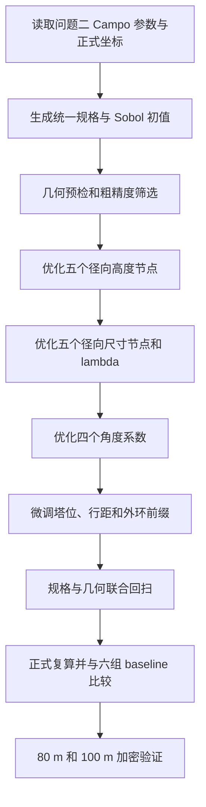

# 第三问

塔位与 Campo 几何微调下的径向—角度连续异构镜场优化方案

> 本文档给出第三问的论文主线、变量设计、搜索流程、输出安排和结论口径。
> 完整公式见 [`第三问公式说明.md`](第三问公式说明.md)，实现与运行说明见
> [`q3_campo2d/技术说明.md`](q3_campo2d/技术说明.md)。原六组方案已完整
> 备份并作为数值 baseline；旧五节点纯径向方案保留为历史实现。

> **结果状态：** 新模型已完成代码、8 项专项测试和端到端 smoke 验证，
> 尚未完成多起点正式搜索、正式复算与加密验证。本章所有新结果位置均标为
> “待正式计算”；smoke 的单时刻数值不得写入论文结论。

---

## 1. 本问定位

问题二得到了一套统一镜面规格的改进 Campo 镜场。第三问允许不同定日镜
采用不同的镜面宽度、镜面高度和安装高度。规格变为异构后，问题二针对统一
规格得到的塔位和径向行距未必仍是较优值，因此本问将问题二方案作为中心
初值，在保留 Campo 生成规律的前提下进行小范围再优化。

本问唯一主方案为

$$
\boxed{
\begin{aligned}
&\text{问题二改进 Campo 方案作为中心初值}\\
&+\text{Sobol 低差异序列生成分散起点}\\
&+\text{塔位、径向行距与外边界小范围微调}\\
&+\text{五节点径向连续主趋势}\\
&+\text{同环中心化角度修正}\\
&+\text{分块 best-improvement 搜索}\\
&+\text{正式与加密精度验收}
\end{aligned}
}
$$

三条实现路径严格分开：

- `src/heliostat/q3/` 保存原六组方案，六组只用于最终数值比较；
- `src/heliostat/q3_continuous/` 保存旧五节点纯径向历史方案；
- `src/heliostat/q3_campo2d/` 是本问新的正式实现。

六组 baseline 不用于生成新模型初值，不参与参数拟合，也不进入新模型的
候选接受规则。新方案能否取代六组，只由统一正式精度下的最终结果决定。

---

## 2. 基线、目标与评价口径

问题二正式 Campo 方案的塔位与统一规格为
$x_T^{(0)}=0$、$y_T^{(0)}=-181.800054\ \mathrm{m}$，
$w_0=6.746757\ \mathrm{m}$、$h_0=6.228727\ \mathrm{m}$、
$H_0=4.110585\ \mathrm{m}$。初始径向行距为
$D_1^{(0)}=11.860146\ \mathrm{m}$，行距增长量为
$g^{(0)}=0.173573\ \mathrm{m/环}$。

问题二正式镜场含 28 环、1469 面镜子，正式结果为
$\overline P_0=42.044238\ \mathrm{MW}$、
$q_0=0.681068\ \mathrm{kW/m^2}$。其中第 28 环最后删除了一对东西对称
镜位。新实现从问题二坐标自动恢复这对结构标签，再在基准几何下按同一标签
排除，因此统一规格起点能逐坐标精确复现问题二的 1469 面镜场。

原六组方案的正式结果为
$\overline P_{\mathrm{six}}=42.051608\ \mathrm{MW}$、
$q_{\mathrm{six}}=0.691896\ \mathrm{kW/m^2}$。该结果只作为最终验收
baseline。

设新镜场含 $N$ 面镜子，第 $i$ 面镜子的宽度、高度、安装高度和面积分别为
$w_i$、$h_i$、$H_i$ 和 $A_i=w_ih_i$。总面积为
$A_{\mathrm{total}}=\sum_{i=1}^{N}A_i$。第三问优化目标为

$$
\boxed{
\max q=max\frac{1000\,\overline P}{A_{\mathrm{total}}}
}
\qquad\text{s.t.}\qquad
\boxed{\overline P\ge42\ \mathrm{MW}}.
$$

当两个候选均满足功率约束时，直接选择 $q$ 更高者，不能优先选择功率余量
更大的候选。未满足功率约束的候选不能作为正式解。

---

## 3. Campo 几何的小范围再优化

### 3.1 保留的生成规则

第三问继续采用问题二的改进 Campo 规则：

- 首环名义镜子数固定为 $N_1=72$；
- 周向镜数按 Campo 区域依次取 $N_1$、$2N_1$、$4N_1$；
- 同一区域内相邻圆环采用半个周向间距的相位交错；
- 径向行距随圆环编号线性增加；
- 超出半径 $350\ \mathrm{m}$ 场地边界的镜位直接裁剪；
- 塔周 $100\ \mathrm{m}$ 禁区和镜间距约束始终有效。

本问不重新选择布局类型，不改变首环镜数，也不改变 Campo 的区域倍增规则。

### 3.2 开放的几何变量

主搜索固定 $x_T=0$，开放
$\Theta_{\mathrm{geo}}=(y_T,D_1,g,L)$，其中 $y_T$ 为塔的南北坐标，
$D_1$ 为初始径向行距，$g$ 为行距增长量，$L$ 为保留的外层圆环前缀。
局部搜索范围为
$y_T\in[-195,-170]\ \mathrm{m}$、
$D_1\in[11.1,12.7]\ \mathrm{m}$、
$g\in[0.08,0.28]\ \mathrm{m/环}$，且 $24\le L\le32$。

塔位变化时不能只移动塔而固定原镜位。对每组候选
$(y_T,D_1,g,L)$，程序重新生成 Campo，重新执行场地裁剪、结构化外层
排除、径向/角度特征计算、异构几何检查和完整光学评价。

---

## 4. 径向—角度连续异构规格

### 4.1 径向坐标和五个节点

第 $i$ 面镜子相对塔位的距离和角度分别为 $r_i$ 与 $\theta_i$。角度从
“塔指向场地圆心”的方向开始计量，$\theta_i=0$ 表示塔的北侧，
$\theta_i=\pm\pi/2$ 表示东西侧翼。

设当前候选含 $K$ 个有效圆环，第一处 Campo 周向镜数切换发生在第 $k_z$
环。五个控制环取为
$k_1=1$、$k_2\approx(1+k_z)/2$、$k_3=k_z$、
$k_4\approx(k_z+K)/2$、$k_5=K$；取整冲突时移动到最近的未使用圆环。
问题二基准几何得到的节点为第 1、7、12、20、28 环。

由节点半径构造五个分段线性帽函数 $B_j(r)$，满足
$B_j(r_i)\ge0$ 且 $\sum_{j=1}^{5}B_j(r_i)=1$。

### 4.2 环内中心化角度特征

为保持东西对称，只使用余弦项。对第 $i$ 面镜子所在圆环 $k(i)$，定义

$$
\psi_{1,i}=\cos\theta_i-
\frac{1}{n_{k(i)}}\sum_{l\in k(i)}\cos\theta_l,
\qquad
\psi_{2,i}=\cos2\theta_i-
\frac{1}{n_{k(i)}}\sum_{l\in k(i)}\cos2\theta_l.
$$

每个圆环内两项特征的均值均为 0。径向节点决定该环的平均规格，角度项只
描述同一圆环内部的方向差异。令归一化半径为 $u_i\in[0,1]$，角度修正乘以
$u_i$，使近塔内圈的角度扰动自然减弱。

### 4.3 镜面尺寸

五个尺寸节点为 $\alpha_{1:5}$，两个尺寸角度系数为 $a_1,a_2$。尺寸形状为

$$
g_i=\sum_{j=1}^{5}\alpha_jB_j(r_i)
+u_i\left(a_1\psi_{1,i}+a_2\psi_{2,i}\right).
$$

对其进行全场中心化：

$$
\widetilde g_i=g_i-\frac{1}{N}\sum_{l=1}^{N}g_l.
$$

引入全局尺度 $\lambda>0$，逐镜尺度与宽高为

$$
\boxed{
s_i=\lambda\exp(\widetilde g_i),
\qquad
w_i=s_iw_0,
\qquad
h_i=s_ih_0
}.
$$

模型固定问题二长宽比，只优化共同尺度。中心化消除了五个尺寸节点同时平移
产生的冗余，并将空间形状与全场面积水平分开。

### 4.4 安装高度

五个高度节点为 $\beta_{1:5}$，两个高度角度系数为 $b_1,b_2$。安装高度为

$$
\boxed{
H_i=\sum_{j=1}^{5}\beta_jB_j(r_i)
+u_i\left(b_1\psi_{1,i}+b_2\psi_{2,i}\right)
}.
$$

尺寸和高度均不施加单调约束。“外圈较高、外圈较小”只可用于生成弱工程
初值，最终形状由全场评价决定。

### 4.5 完整变量

完整决策向量为

$$
\boxed{
\Theta_3=
\left(
y_T,D_1,g,L,
\alpha_{1:5},
\beta_{1:5},
a_1,a_2,b_1,b_2,
\lambda
\right)
}.
$$

所有逐镜规格由同一组连续函数生成，不对约一千五百面镜子逐面独立搜索。

---

## 5. 异构光学评价与几何约束

第 $i$ 面镜子的镜心为 $\boldsymbol c_i=(x_i,y_i,H_i)$。第 $t$ 个规定
时刻的综合效率沿用问题一完整模型：

$$
\eta_{i,t}=
\eta_{\cos,i,t}
\eta_{\mathrm{sb},i,t}
\eta_{\mathrm{at},i}
\eta_{\mathrm{trunc},i,t}
\eta_{\mathrm{ref}}.
$$

镜面采样范围、遮挡矩形、镜心高度、截断采样位置和采光面积均按逐镜参数
计算。镜场时刻输出为
$P_t=DNI_t\sum_iA_i\eta_{i,t}$。不同镜面面积不相同时，任一平均效率必须
按面积加权，不能对逐镜效率做简单算术平均。

逐镜规格满足 $2\le h_i\le w_i\le8$、$2\le H_i\le6$ 和
$H_i\ge h_i/2$。场地与禁区满足
$x_i^2+y_i^2\le350^2$ 和
$\sqrt{(x_i-x_T)^2+(y_i-y_T)^2}\ge100$。

异构镜间距采用

$$
\boxed{
d_{ij}>\max(w_i,w_j)+5+\varepsilon,
\qquad
\varepsilon=0.01\ \mathrm{m}
}.
$$

程序先用 KD 树筛选近邻镜对，再做精确异构宽度检查；几何非法候选不进入
光学计算。

---

## 6. Sobol 初值与分块搜索

Sobol 序列只用于在局部参数范围内均匀产生分散起点，不是本问的优化算法。
初值集合包含问题二统一规格起点和若干经过扰动的 Sobol 起点。所有初值先做
几何预检，再用粗精度评价；保留统一规格起点以及少量数值较优、参数差异
明显的 Sobol 起点。

搜索流程为：

每个参数块采用 best-improvement：先生成本轮全部合法邻域候选，以粗精度
统一排序，再将前若干个候选送中精度复算，最后接受其中满足功率约束且 $q$
最高、并超过当前解的候选。它不同于“遇到第一个改善就立即接受”。

径向高度步长为 $0.4,0.2,0.1,0.05\ \mathrm{m}$，尺寸形状步长为
$0.04,0.02,0.01,0.005$，$\lambda$ 步长为 $0.005,0.001,0.0002$。
塔位步长由 $4\ \mathrm{m}$ 逐级缩小至 $0.5\ \mathrm{m}$。径向、角度、
全局尺度和几何完成一轮后进行联合回扫；连续两轮中精度 $q$ 改善小于
$10^{-5}$ 时停止，或达到联合循环上限。

---

## 7. 精度安排与验收

| 阶段 | 状态数 | 阴影网格 | 截断光线 | 邻镜半径 | 用途 |
| --- | ---: | ---: | ---: | ---: | --- |
| 粗精度 | $4\times5=20$ | $5\times5$ | 64 | 60 m | Sobol 与批量候选排序 |
| 中精度 | $12\times5=60$ | $10\times10$ | 128 | 60 m | 接受和收敛判断 |
| 正式精度 | $12\times5=60$ | $15\times15$ | 256 | 60 m | 多起点最终选择 |
| 加密精度 | $12\times5=60$ | $20\times20$ | 512 | 80 m、100 m | 稳健性验证 |

粗精度只负责排序，不能作为最终可行性结论。正式候选必须满足以下条件：

1. 正式精度下 $\overline P\ge42\ \mathrm{MW}$；
2. 80 m 与 100 m 加密复算仍满足功率约束；
3. 所有尺寸、触地、场地、禁区和镜间距约束通过；
4. 多个保留初值的最终结果得到完整报告；
5. 若将新模型作为最终第三问方案，正式 $q$ 应达到或超过六组 baseline。

若新模型正式结果低于 $q_{\mathrm{six}}=0.691896\ \mathrm{kW/m^2}$，
则必须如实保留六组为最终数值方案，不能因为新模型更连续而强行替换。

---

## 8. 输出与论文图表

新方案使用独立目录 `outputs/q3_campo2d/`，输出包括：

- Sobol 初值与筛选结果、分块搜索轨迹；
- 最终逐镜坐标、尺寸、高度和径向/角度分解；
- 60 个逐时刻、12 个月、年平均和单镜年平均结果；
- 逐环统计与代表性圆环的角度分箱统计；
- 问题二、六组和新模型的 baseline 比较；
- 最终摘要、几何验证、加密验证和 `result3.xlsx`；
- 单镜面积/高度空间图、径向/角度趋势图、问题二空间对照图和 baseline/月度图。

正文使用三张表：最终设计参数、正式 baseline 比较、几何与加密验证。四张图
分别回答规格空间变化、径向与角度作用、单镜输出空间变化和最终数值竞争力。

---

## 9. 当前实现验证

当前已完成：

- 问题二 1469 面正式坐标逐点精确回归；
- 自动识别第 28 环两面结构化排除镜位；
- 基准几何五个控制环为第 1、7、12、20、28 环；
- 径向基函数非负且逐镜和为 1；
- 每个圆环内的两项角度特征均值为 0；
- 塔位变化时重新生成 Campo，而不是只移动塔；
- Sobol 初值可复现；
- 8 项 `q3_campo2d` 专项测试通过；
- 两起点单时刻 smoke 搜索和 02–20 输出链路通过。

smoke 仅使用六月正午一个状态，其数值只证明程序链路工作。当前尚未执行
正式多起点年平均搜索，因此以下结果均保持待计算。

---

## 10. 正式结果占位

### 10.1 最终设计参数

| 参数 | 最终值 |
| --- | ---: |
| 塔坐标 $(x_T,y_T)$ / m | 待正式计算 |
| 初始行距 $D_1$ / m | 待正式计算 |
| 行距增长量 $g$ / m/环 | 待正式计算 |
| 有效圆环数 | 待正式计算 |
| 镜子数 | 待正式计算 |
| 全局尺度 $\lambda$ | 待正式计算 |
| 尺寸节点 $\alpha_{1:5}$ | 待正式计算 |
| 高度节点 $\beta_{1:5}$ / m | 待正式计算 |
| 尺寸角度系数 $a_1,a_2$ | 待正式计算 |
| 高度角度系数 $b_1,b_2$ / m | 待正式计算 |

### 10.2 正式年平均结果

| 指标 | 问题二统一规格 | 六组 baseline | 新 Campo2D |
| --- | ---: | ---: | ---: |
| 镜子数 | 1469 | 1471 | 待正式计算 |
| 年平均输出热功率 / MW | 42.044238 | 42.051608 | 待正式计算 |
| 总镜面面积 / $\mathrm{m^2}$ | 61732.830 | 60777.391 | 待正式计算 |
| 单位面积输出 / $\mathrm{kW/m^2}$ | 0.681068 | 0.691896 | 待正式计算 |
| 加密复算满足 42 MW | 是 | 是 | 待验证 |

---

## 11. 结论口径

正式运行完成前，只能表述为“建立并验证了新的径向—角度连续 Campo 搜索
框架”，不能声称新模型已经优于六组。正式结果完成后，应在统一精度下同时
报告问题二、六组 baseline 和新模型；若新模型未超过六组，则六组继续作为
第三问最终数值方案，新模型作为连续建模与几何联合优化实验保留。
