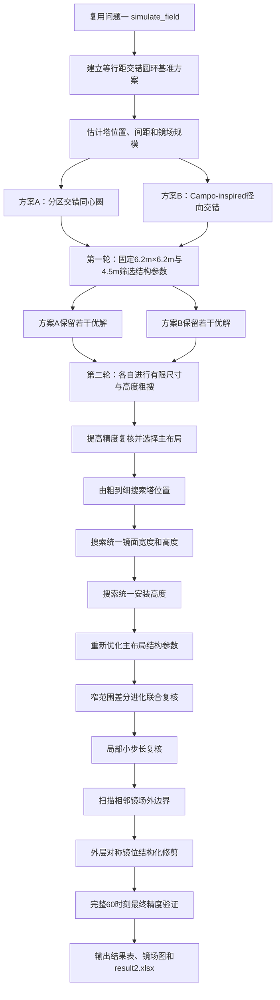

# 第二问：定日镜场优化设计

## 1. 问题重述与总体思路

第二问要求在所有定日镜具有统一镜面尺寸和安装高度的条件下，自行确定吸收塔位置、定日镜数量及全部镜位坐标，使镜场年平均输出热功率不低于 \(42\ \mathrm{MW}\)，并最大化单位镜面面积年平均输出热功率。

若直接把数千面定日镜的坐标全部作为决策变量，优化维数过高，镜间距、场地边界和阴影遮挡等约束也难以处理。因此，本问不直接优化每一面镜子的坐标，而是用少量参数描述结构化镜场，再由布局生成器自动产生全部镜位。

整体求解路线为：

$$
\boxed{
\text{基础交错圆环}
\rightarrow
\text{双布局两轮筛选}
\rightarrow
\text{选定主布局}
\rightarrow
\text{由粗到细搜索}
\rightarrow
\text{窄范围联合复核}
\rightarrow
\text{结构化修剪}
}
$$

其中，两种候选改进布局分别为：

1. 分区交错同心圆布局；
2. Campo-inspired 简化径向交错布局。

两种布局均将问题一的核心光学计算过程复用并封装为 `simulate_field` 评价程序，使用相同的太阳位置、DNI、余弦效率、大气透射率、阴影遮挡效率和截断效率模型，不另行建立代理模型，也不使用忽略镜间相互作用的单镜评分代替完整镜场评价。

---

## 2. 优化模型

### 2.1 决策变量

设所有定日镜的统一镜面宽度、高度和安装高度分别为

$$
w,\qquad h,\qquad H.
$$

吸收塔地面坐标为

$$
T=(x_T,y_T),
$$

第 \(i\) 面定日镜的中心平面坐标为

$$
(x_i,y_i),\qquad i=1,2,\ldots,N.
$$

镜位坐标不作为彼此独立的优化变量，而由塔位置、镜面尺寸和布局参数共同生成。记一套完整设计参数为 \(\Theta\)，则问题一评价器给出的年平均输出热功率为

$$
\overline P(\Theta).
$$

所有定日镜尺寸相同，因此总镜面面积为

$$
A_{\mathrm{total}}=Nwh.
$$

### 2.2 目标函数

单位镜面面积年平均输出热功率为

$$
q(\Theta)
=
\frac{\overline P(\Theta)}
{Nwh}.
$$

第二问的优化模型写为

$$
\boxed{
\max_{\Theta}\ q(\Theta)
}
$$

并满足年平均输出热功率约束

$$
\boxed{
\overline P(\Theta)\ge 42\ \mathrm{MW}.
}
$$

需要注意，\(42\ \mathrm{MW}\) 是功率下界，而不是必须严格达到的等式。增加一组面积为 \(\Delta A\)、带来全场功率增量 \(\Delta P\) 的镜子后，仅当

$$
\frac{\Delta P}{\Delta A}>
\frac{\overline P}{A_{\mathrm{total}}}
$$

时，单位面积功率才会上升。因此，达到 \(42\ \mathrm{MW}\) 后仍需比较若干相邻的镜场规模，不能预先认定第一次跨过功率阈值的镜场必然最优。

### 2.3 约束条件

镜面尺寸满足

$$
2\le h\le w\le 8.
$$

安装高度满足

$$
2\le H\le 6,
\qquad
H\ge \frac h2,
$$

其中第二个条件用于保证镜面转动时不接触地面。

任意两面定日镜的底座中心距离满足

$$
d_{ij}
=
\sqrt{(x_i-x_j)^2+(y_i-y_j)^2}
\ge w+5.
$$

定日镜中心必须位于半径为 \(350\ \mathrm{m}\) 的场地内：

$$
x_i^2+y_i^2\le 350^2.
$$

定日镜中心到吸收塔地面位置的距离不得小于 \(100\ \mathrm{m}\)：

$$
\sqrt{(x_i-x_T)^2+(y_i-y_T)^2}\ge 100.
$$

本问采用与题目和问题一一致的“镜面中心”口径检查场地边界和塔周禁区。

---

## 3. 问题一光学评价器的复用

对每一组布局参数，先由布局生成器产生合法镜位，再调用

```text
simulate_field(
    tower_position,
    mirror_width,
    mirror_height,
    installation_height,
    mirror_coordinates
)
```

计算题目规定的 \(12\times5=60\) 个时刻，并输出：

- 年平均输出热功率；
- 单位镜面面积年平均输出热功率；
- 平均光学效率；
- 平均余弦效率；
- 平均大气透射率；
- 平均阴影遮挡效率；
- 平均截断效率；
- 月平均结果和全年平均结果。

阴影遮挡仍采用问题一的镜面规则网格射线追踪方法，并通过 KD 树筛选一定范围内的候选遮挡镜；截断效率仍采用固定 Sobol 样本进行光线追踪。

各阶段始终采用同一套物理模型和同一个 `simulate_field` 程序，均计算余弦、大气透射、阴影遮挡和截断等全部损失项，但允许根据搜索阶段调整数值离散精度：

- 初步探索阶段使用较低密度的阴影网格和较少的截断光线，快速排除明显较差的参数区域；
- 中间细化阶段提高网格密度和截断光线数量，重新评价保留方案；
- 最终入围方案统一采用问题一的最终精度，即完整 60 个规定时刻、\(15\times15\) 阴影网格和 256 条截断光线进行复算。

这种处理只改变数值离散密度，不改变物理公式、效率组成或镜间相互作用，因此不属于另建“快速评价模型”。同一搜索阶段内的所有候选方案必须使用相同精度、相同 Sobol 样本及相同随机种子，使目标函数在重复评价时保持确定，并保证不同布局之间的比较公平。

---

## 4. 基础方案 B0：等行距交错同心圆

基础方案用于估计吸收塔南移距离、圆环间距、镜面总面积和镜子数量的合理量级，并作为两种改进布局的比较基准。

固定镜面参数为

$$
w=h=6.2\ \mathrm{m},
\qquad
H=4.5\ \mathrm{m}.
$$

由于场地和全年太阳运动关于南北轴近似对称，第一阶段令

$$
x_T=0,\qquad y_T\le 0,
$$

即只搜索吸收塔向南移动的距离。最终再在 \(x_T=0\) 附近进行少量东西偏移验证。

### 4.1 圆环半径

以吸收塔为圆心，按统一行距 \(\Delta r\) 生成圆环：

$$
r_k=r_1+(k-1)\Delta r,
$$

其中首环半径取

$$
r_1\ge 100.
$$

在采用中心禁区约束时可令 \(r_1=100\ \mathrm{m}\)；实际生成后仍统一进行精确约束检查。

### 4.2 每环镜子数量

最低中心距离为

$$
d_{\min}=w+5.
$$

半径为 \(r_k\) 的圆环上，相邻两面镜子的中心弦长不得小于 \(d_{\min}\)。因此，单圈允许的最大镜子数为

$$
N_k
=
\left\lfloor
\frac{\pi}
{\arcsin\!\left(d_{\min}/2r_k\right)}
\right\rfloor.
$$

### 4.3 圆环交错与坐标生成

相邻圆环错开半个角间距。令角度从正 \(y\) 轴开始计算，则

$$
\theta_{k,j}
=
\frac{2\pi j}{N_k}+\phi_k,
\qquad
j=0,1,\ldots,N_k-1,
$$

其中

$$
\phi_k=
\begin{cases}
0, & k\text{ 为奇数},\\[4pt]
\dfrac{\pi}{N_k}, & k\text{ 为偶数}.
\end{cases}
$$

对应镜位为

$$
x_{k,j}=x_T+r_k\sin\theta_{k,j},
$$

$$
y_{k,j}=y_T+r_k\cos\theta_{k,j}.
$$

由于相邻圆环的镜子数可能不同，半角交错并不能自动保证跨环距离合法。生成每一圈后，必须对跨环最近距离进行精确检查；若发生冲突，则判定该组行距参数不可行，并由外层搜索增大相应行距后重新生成镜场，不能单独移动某一圈或在镜场内部随意删除镜位。

基础方案仅粗略搜索

$$
y_T,\qquad \Delta r,
$$

得到合法且满足功率约束的基准指标 \(q_0\)。

---

## 5. 改进方案 A：分区交错同心圆

分区交错同心圆布局在基础方案上引入“近区紧、远区松”的分区行距。

以吸收塔为圆心，将镜场划分为

$$
100\le r<R_s
$$

和

$$
r\ge R_s
$$

两个区域。近区行距为 \(\Delta r_1\)，远区行距为 \(\Delta r_2\)，并要求

$$
\Delta r_2\ge\Delta r_1.
$$

圆环半径按下式递推：

$$
r_{k+1}
=
\begin{cases}
r_k+\Delta r_1, & r_k<R_s,\\[4pt]
r_k+\Delta r_2, & r_k\ge R_s.
\end{cases}
$$

每个圆环的镜子数、交错相位和坐标计算方法与基础方案相同。方案 A 的参数为

$$
\boxed{
\Theta_A=
\left(
y_T,w,h,H,R_s,\Delta r_1,\Delta r_2
\right).
}
$$

该布局的核心作用是检验：在近塔区域适当加密、在远塔区域适当增大行距，能否在控制阴影遮挡的同时提高近塔高效率区域的利用程度。

---

## 6. 改进方案 B：Campo-inspired 简化径向交错布局

方案 B 不预先指定固定行距，而是利用相邻镜子的特征距离和径向交错关系确定下一圈的位置。该方案借鉴 Campo 径向交错密排思想，但不宣称完整复现工程版 Campo，因此称为 Campo-inspired 简化布局。

### 6.1 特征距离和首环

定义特征距离

$$
d_c=\lambda d_{\min},
\qquad
\lambda\ge 1.
$$

设第一圈镜子数为整数 \(N_1\)，首环半径取

$$
r_1
=
\max\left\{
100,\,
\frac{d_c}{2\sin(\pi/N_1)}
\right\}.
$$

\(N_1\) 不作为普通连续变量放入优化器后再四舍五入，而是在少量候选整数下分别优化其余参数。

### 6.2 同一圆环组内的径向递推

在同一圆环组内保持镜子数不变，相邻两圈交错半个角间距。令

$$
\alpha_k=\frac{\pi}{N_k}.
$$

若相邻圈的最近镜间距离取 \(d_c\)，则由余弦定理有

$$
d_c^2
=
r_k^2+r_{k+1}^2
-2r_kr_{k+1}\cos\alpha_k.
$$

取大于 \(r_k\) 的外侧解：

$$
r_{k+1}
=
r_k\cos\alpha_k
+
\sqrt{
d_c^2-r_k^2\sin^2\alpha_k
}.
$$

该闭式递推仅适用于相邻两圈镜子数相同的情形，并要求根号内非负。

### 6.3 圆环组切换

第 \(k\) 圈的周向弦长为

$$
s_k
=
2r_k\sin\frac{\pi}{N_k}.
$$

当

$$
s_k>\mu d_c
$$

时，原圆环组在外圈已经过于稀疏，需要增加镜子数并建立新圆环组。为使切换在闭式递推失效前发生，搜索时限制

$$
1<\mu<2.
$$

若希望新组的周向间距不小于 \(d_c\)，则目标镜子数采用向下取整：

$$
N_{\mathrm{new}}
=
\left\lfloor
\frac{\pi}
{\arcsin\!\left(d_c/2r_k\right)}
\right\rfloor.
$$

同时要求 \(N_{\mathrm{new}}>N_k\)。圆环组切换后，新旧两圈的镜子数不同，不能继续直接使用前述闭式公式。此时采用以下确定性规则：

1. 在一个新圈角间距范围内搜索少量相位候选；
2. 选择使新圈与上一圈最小角距离最大的相位；
3. 对新圈半径进行一维搜索；
4. 找到满足新圈内部和跨环镜间距均不小于 \(d_c\) 的最小合法半径；
5. 最后再由统一约束检查器复核实际最低距离 \(d_{\min}\)。

方案 B 的参数为

$$
\boxed{
\Theta_B=
\left(
y_T,w,h,H,N_1,\lambda,\mu
\right).
}
$$

---

## 7. 偏心吸收塔下的场地裁剪

两种布局均以吸收塔为圆心生成圆环，但场地圆仍以坐标原点为圆心。当 \(y_T<0\) 时，完整圆环若要全部位于场地内，必须满足

$$
r\le 350-|y_T|.
$$

超过该半径后，圆环南侧会先越出场地，而北侧仍可能存在合法镜位。因此，实际算法不能假定“除最后一圈外所有圆环都完整”，而应执行：

1. 按塔心圆环生成全部候选镜位；
2. 检查每个候选点是否位于场地内；
3. 对越界镜位按东西对称镜位对同时删除；
4. 对剩余镜位重新检查塔周禁区和镜间距。

经过场地裁剪后，外层布局可能表现为对称圆弧而不是完整圆环，但仍保持关于南北轴的结构对称性。

---

## 8. 镜场规模和镜子数量的确定

镜子数量 \(N\) 不作为独立连续变量，而是在给定布局参数后，通过镜场外边界扫描和对称修剪确定。

### 8.1 初始规模估计

由基础方案单位面积功率 \(q_{\mathrm{ref}}\) 估计达到 \(42\ \mathrm{MW}\) 所需的镜面面积：

$$
A_{\mathrm{est}}
=
\frac{42\,000}{q_{\mathrm{ref}}},
$$

其中功率以 \(\mathrm{kW}\) 为单位，\(q_{\mathrm{ref}}\) 以 \(\mathrm{kW/m^2}\) 为单位。该结果仅用于估计圆环数量，不作为总面积硬约束。

### 8.2 外边界扫描

给定一组布局参数后，按照半径从小到大生成各圈全部合法镜位。记前 \(K\) 个合法圆环或圆弧构成的镜场为

$$
S_K=\bigcup_{k=1}^{K}R_k.
$$

调用完整评价器计算

$$
\overline P_K=\overline P(S_K),
\qquad
q_K=\frac{\overline P_K}{|S_K|wh}.
$$

找到首次满足

$$
\overline P_K\ge42\ \mathrm{MW}
$$

的镜场后，不立即停止，而是继续评价若干相邻外层组合；对最终入围的布局参数，应将镜场外边界作为一维离散变量进行完整扫描。所有满足功率约束的候选镜场均按 \(q_K\) 排序，从而避免把功率下界错误地当成等式约束。

若场地内全部合法镜位仍不能达到 \(42\ \mathrm{MW}\)，则该参数组合判为不可行。

### 8.3 最外层结构化修剪

在较优可行镜场上，对最外层一个或若干圆环中的东西对称镜位对进行删除试验。设一对镜位为

$$
j=(x,y),\qquad j'=(-x,y),
$$

则删除该镜位对造成的真实全场功率变化为

$$
\Delta P_j
=
\overline P(S)
-
\overline P\!\left(S\setminus\{j,j'\}\right).
$$

这里必须重新调用 `simulate_field`，因为删除镜子不仅减少其自身输出，还可能减轻其他镜子的阴影遮挡。

每轮分别评价可删除的对称镜位对，并仅在

$$
\overline P_{\mathrm{new}}\ge42\ \mathrm{MW}
$$

且

$$
q_{\mathrm{new}}>q_{\mathrm{old}}
$$

时接受删除。重复这一过程，直到不存在能够继续提高目标函数的合法删除操作。这样既保留镜场整体规则性，也避免按任意镜位编号顺序增减镜子。

---

## 9. 完整优化过程

### 9.1 阶段一：建立基础方案

固定

$$
w=h=6.2\ \mathrm{m},
\qquad
H=4.5\ \mathrm{m},
$$

粗略搜索吸收塔南移距离 \(y_T\) 和统一行距 \(\Delta r\)，得到等行距交错圆环基准方案。该阶段主要确定：

- 吸收塔南移距离的大致范围；
- 合理圆环间距；
- 达到 \(42\ \mathrm{MW}\) 所需镜面面积和镜子数量的量级；
- 基准单位面积功率 \(q_0\)。

### 9.2 阶段二：双布局两轮筛选

第一轮继续固定

$$
w=h=6.2\ \mathrm{m},
\qquad
H=4.5\ \mathrm{m}.
$$

方案 A 探索

$$
y_T,\ R_s,\ \Delta r_1,\ \Delta r_2,
$$

方案 B 探索

$$
y_T,\ N_1,\ \lambda,\ \mu.
$$

对两种布局分别采用少量正交设计或 Sobol 低差异采样，使用近似相同的参数组合数量、完全相同的镜场评价程序和统一的晋级规则，得到

$$
q_A^{(0)},
\qquad
q_B^{(0)}.
$$

第一轮的作用不是直接决定最终主布局，而是排除明显不合理的结构参数范围，并为每种布局各保留若干较优候选。

第二轮分别以两种布局保留的候选为基础，对镜面宽度、镜面高度和安装高度进行一次小规模粗搜。此时只选取少量具有代表性的 \(w,h,H\) 水平，不进行完整的顺序细化或差分进化。每次改变镜面宽度后，都重新计算最低中心距离、圆环镜子数和径向结构，并重新生成全部镜位。

记两种布局经过有限尺寸和高度粗搜后的最好结果为

$$
q_A^{(1)},
\qquad
q_B^{(1)}.
$$

第二轮完成后，再依据单位面积功率选择进入完整优化的主布局。这样能够同时比较布局结构及其对统一镜面参数的适应性，避免仅凭 \(6.2\ \mathrm{m}\times6.2\ \mathrm{m}\)、\(4.5\ \mathrm{m}\) 这一组参数过早淘汰另一种布局。

如果两种布局第二轮结果的差异小于当前数值精度的收敛误差，则提高计算精度复核；仍无法区分时，各保留一个最优方案完成一轮短程顺序细化后再决定主布局。两种布局不必都运行完整联合优化。

### 9.3 阶段三：由粗到细的顺序搜索

在胜出布局中依次优化以下参数。

#### （1）吸收塔位置

先固定

$$
x_T=0,
$$

以较大步长搜索 \(y_T\)，找到较优区间后缩小步长细化。最终在

$$
x_T\in\{-10,-5,0,5,10\}\ \mathrm{m}
$$

等少量位置进行对称性验证；若东西偏移没有稳定改进，则保留 \(x_T=0\)。

#### （2）镜面宽度和高度

先重点搜索

$$
5\le w\le7.5,
\qquad
4.5\le h\le w.
$$

若最优结果贴近搜索边界，再扩展到题目允许的 \(2\sim8\ \mathrm{m}\) 范围。先采用较大步长确定范围，再缩小步长细化。

每次改变 \(w\) 或 \(h\) 后，都必须重新生成全部镜位，因为最低中心距离 \(w+5\)、每圈镜子数量、圆环半径和 Campo 特征距离均会随之改变。

#### （3）安装高度

在已确定的镜面宽、高附近搜索

$$
H\in
\left[
\max\left(2,\frac h2\right),6
\right].
$$

同样先粗搜再细化。安装高度主要通过镜面空间姿态和阴影遮挡影响结果，因此放在塔位置和镜面尺寸之后优化。

#### （4）重新优化布局参数

确定塔位置、镜面尺寸和安装高度后，重新搜索主布局的结构参数：

$$
R_s,\ \Delta r_1,\ \Delta r_2
$$

或

$$
N_1,\ \lambda,\ \mu.
$$

这一步不可省略，因为镜面宽度改变后，原先的最优镜间距与圆环结构通常不再适用。

### 9.4 阶段四：窄范围联合复核

顺序搜索能够有效缩小各参数范围，但不能完全消除塔位置、镜面尺寸、安装高度与布局间距之间的耦合。因此，在主布局和各参数窄区间已经确定后，可采用差分进化进行一次小规模联合复核。

若方案 A 胜出，连续参数向量为

$$
\boldsymbol z_A=
\left(
y_T,w,h,H,R_s,\Delta r_1,\Delta r_2
\right).
$$

若方案 B 胜出，则对每个保留的整数 \(N_1\) 分别优化

$$
\boldsymbol z_B=
\left(
y_T,w,h,H,\lambda,\mu
\right).
$$

差分进化以顺序搜索得到的优良方案作为初始参考，在限定评价次数内通过差分变异、交叉和优胜劣汰检验是否存在更好的参数组合。候选方案仍采用第 10 节的可行性优先规则比较；离散参数 \(N_1\) 在少量整数候选下分别处理，不通过连续优化后四舍五入获得。

差分进化只承担最终的联合复核，不直接在原始大范围内搜索，不优化单面镜坐标，也不作为本问的模型主体。若其结果不能稳定优于顺序搜索结果，则保留解释性更强的顺序搜索方案。

### 9.5 阶段五：局部复核和结构化修剪

在联合复核得到的最优方案附近，对塔位置、镜面尺寸、安装高度和布局间距进行小步长坐标搜索。每次修改后重新生成镜场并调用完整评价器，仅当新方案满足功率约束且单位面积功率提高时才接受。

最后执行第 8.3 节的外层对称镜位修剪，确定最终镜子数量和全部坐标。

---

## 10. 可行性优先比较规则

布局生成阶段首先检查全部几何约束。存在场地越界、塔周禁区冲突、镜面触地或镜间距不足的候选方案直接判为几何不可行，不进入光学评价。

对几何合法的候选方案采用可行性优先规则：

1. 满足 \(42\ \mathrm{MW}\) 功率约束的方案优于不满足者；
2. 两个方案均满足功率约束时，选择单位面积功率 \(q\) 更大的方案；
3. 两个方案均不满足功率约束时，选择年平均功率更大的方案；
4. 若单位面积功率差异小于数值误差，则以高精度复算结果决定。

写成数学形式：

$$
\overline P_1\ge42,\quad
\overline P_2<42
\quad\Longrightarrow\quad
\Theta_1\succ\Theta_2;
$$

$$
\overline P_1,\overline P_2\ge42,\quad
q_1>q_2
\quad\Longrightarrow\quad
\Theta_1\succ\Theta_2;
$$

$$
\overline P_1,\overline P_2<42,\quad
\overline P_1>\overline P_2
\quad\Longrightarrow\quad
\Theta_1\succ\Theta_2.
$$

这种规则不需要人为设置罚函数系数。

---

## 11. 计算量控制

本问不额外建立快速代理模型。所有候选方案均调用与问题一相同的 `simulate_field` 和相同物理过程，但按照“探索精度—细化精度—最终精度”分层设置数值离散密度。为控制总运行时间，采用以下措施：

1. 先由基础方案估计塔位置、圆环间距、镜面面积和镜子数量的合理量级；
2. 先在固定镜面参数下排除两种布局各自的明显劣区，再让两种布局分别完成有限的尺寸与高度粗搜；
3. 只让第二轮筛选后的胜出布局进入完整顺序优化；
4. 初步探索阶段适当降低阴影网格和截断光线的离散密度，但不删除任何效率项；
5. 先顺序粗搜，再在明显缩小的范围内进行小规模联合复核；
6. 缓存 60 个时刻的太阳方向、DNI 和固定 Sobol 光线样本；
7. 使用 KD 树缩小阴影遮挡候选镜范围；
8. 对相同参数和相同坐标生成唯一哈希，避免重复评价；
9. 固定随机样本，避免优化器把采样噪声误认为真实改进；
10. 在候选参数组之间进行并行计算；
11. 对最终入围方案采用问题一最终精度复算并进行收敛性检查；若最终功率与 \(42\ \mathrm{MW}\) 的差值小于数值误差，则恢复一对边际贡献较高的合法对称镜位，保留必要的可行性余量。

这些措施减少的是数值离散成本、重复计算和无效参数组合，不改变问题一的物理模型。

---

## 12. 算法流程



对应伪代码如下：

```text
1. 用问题一参数建立等行距交错圆环基准方案 B0
2. 估计塔南移距离、合理间距和达到 42 MW 所需镜场规模
3. 固定 w=h=6.2 m、H=4.5 m
4. 第一轮分别采样方案 A 和方案 B 的结构参数
5. 对第一轮每组参数：
      生成塔心圆环候选
      按场地边界进行东西对称裁剪
      检查禁区、触地和镜间距约束
      扫描若干镜场外边界
      调用 simulate_field 计算 P 和 q
6. 每种布局各保留若干较优结构参数
7. 第二轮分别对两种布局进行有限的 w、h、H 粗搜
8. 提高精度复核第二轮结果并选定主布局
9. 对主布局依次细化塔位置、镜面尺寸、安装高度和布局参数
10. 在缩小后的参数范围内用差分进化进行联合复核
11. 在最优解附近进行小步长局部搜索
12. 对最外层对称镜位对进行全场重算和结构化修剪
13. 使用完整 60 时刻和问题一最终精度重新评价
14. 输出最终参数、全部镜位坐标和 result2.xlsx
```

---

## 13. 结果输出

### 13.1 基础方案与双布局筛选

| 阶段 | 布局 | 镜面尺寸 | 安装高度 | 镜子数 | 总镜面面积/\(\mathrm{m^2}\) | 年平均功率/\(\mathrm{MW}\) | 单位面积功率/\(\mathrm{kW/m^2}\) |
| --- | --- | ---: | ---: | ---: | ---: | ---: | ---: |
| 基准 | 等行距交错同心圆 | \(6.2\times6.2\) | \(4.5\) |  |  |  |  |
| 第一轮 | 分区交错同心圆 | \(6.2\times6.2\) | \(4.5\) |  |  |  |  |
| 第一轮 | Campo-inspired 径向交错 | \(6.2\times6.2\) | \(4.5\) |  |  |  |  |
| 第二轮 | 分区交错同心圆 | 粗搜最优值 | 粗搜最优值 |  |  |  |  |
| 第二轮 | Campo-inspired 径向交错 | 粗搜最优值 | 粗搜最优值 |  |  |  |  |

该表用于说明基础方案水平、两种结构化布局在固定参数下的表现，以及两种布局经过有限尺寸与高度粗搜后的比较结果。主布局依据第二轮而不是第一轮结果确定。

### 13.2 最终设计参数

| 参数 | 最终值 |
| --- | ---: |
| 主布局类型 |  |
| 吸收塔坐标 |  |
| 镜面宽度/\(\mathrm{m}\) |  |
| 镜面高度/\(\mathrm{m}\) |  |
| 安装高度/\(\mathrm{m}\) |  |
| 镜子总数 |  |
| 镜面总面积/\(\mathrm{m^2}\) |  |
| 年平均输出功率/\(\mathrm{MW}\) |  |
| 单位面积年平均输出功率/\(\mathrm{kW/m^2}\) |  |

### 13.3 最终效率结果

最终方案应输出：

- 各月平均光学效率；
- 各月平均余弦效率；
- 各月平均阴影遮挡效率；
- 各月平均截断效率；
- 各月平均输出热功率；
- 全年平均效率和功率；
- 全部定日镜中心坐标及统一镜面参数；
- 按题目模板填写的 `result2.xlsx`。

建议绘制以下四幅核心图：

1. 基础布局、方案 A 和方案 B 的平面分布对比图；
2. 吸收塔南移距离与单位面积功率关系图；
3. 最终镜场单镜年平均输出功率空间分布图；
4. 基础方案与最终方案的主要指标对比图。

差分进化收敛曲线不是本问的主要成果图；如需说明联合复核过程，可将其放入附录。

---

## 14. 本问小结

本问首先建立等行距交错同心圆基础布局，用于确定吸收塔位置、圆环间距和镜场规模的合理量级；随后构建分区交错同心圆布局与 Campo-inspired 简化径向交错布局。第一轮在统一镜面尺寸和安装高度下筛选两种布局各自的结构参数，第二轮分别对两种布局保留方案进行有限的镜面尺寸与安装高度粗搜，再依据复核结果选择主布局。选定主布局后，按照吸收塔位置、镜面宽高、安装高度和布局参数的顺序进行由粗到细搜索，并在缩小后的参数区间内用差分进化进行一次联合复核。

对于每组候选参数，镜场坐标均由布局规则自动生成，并统一检查场地边界、塔周禁区、镜面触地和镜间距约束。镜子数量通过镜场外边界扫描确定，不把 \(42\ \mathrm{MW}\) 功率下界预先当作等式；最后根据删除前后的完整镜场功率变化，对外层东西对称镜位对进行结构化修剪，在满足功率约束的前提下进一步提高单位镜面面积年平均输出热功率。

因此，第二问最终采用的不是对全部镜位坐标进行黑箱搜索，而是

$$
\boxed{
\text{结构化布局降维}
+
\text{双布局两轮筛选}
+
\text{顺序粗细搜索}
+
\text{同一模型分级精度评价}
+
\text{外层对称修剪}
}.
$$
